Plumber copyright 中文版本

[english version](https://downloads.plumbr.io/Plumbr%20Handbook%20Java%20Garbage%20Collection.pdf)<br>
*该文章被翻译仅做学习之用*

# 目录
### 什么是垃圾回收
### Java中的垃圾回收
### GC 算法: 基础
### GC 算法: 实现
### GC 优化: 基础
### GC 优化: 工具
### GC 优化: 实践

# 什么是垃圾回收(Garbage Collection, GC)
初看之下, 垃圾回收Garbage Collection, GC)应该是用来-找到和清理掉垃圾的. 但是现实中,它却是做的完全相反的工作. GC是用来追踪那些正在被使用的对象, 然后标记其他的对象为垃圾对象. 将这个牢牢记住, 我们马上就仔细看看JVM中被称为自动垃圾回收再利用的过程是如何实现的.

在开始直接讨论细节之前, 我们来看看最最开始的时候, 垃圾回收的本质, 核心概念和途径.

*声明:这本手册主要关注于Oracle Hotspot和OpenJDK的行为,在其他运行时或者JVM中,比如JROCKIT,IBM J9部分行为可能与本手册所说不太一样*

## **手动内存管理**
在我们开始讨论GC的现代化工作方式之前, 让我们来快速看下以前我们是如何手动和精确的控制内存的申请和释放的. 如果你忘记释放内存,你就没法重用该内存. 这片内存也没法被声明为未使用. 这就是**内存泄漏**

下面是一个使用C写的演示手动内存管理的代码:
```c
int send_request() {
size_t n = read_size();
int *elements = malloc(n * sizeof(int));
    if(read_elements(n, elements) < n) {
        // elements not freed!
        return -1;
    }
    // ...
    free(elements)
    return 0;
}
```
正如我们看到的, 很容易就会忘记释放内存. 内存泄漏也变成了一个非常常见的问题. 你只能通过修改代码来解决. 一个更好的方法就是能够自动回收掉不在使用的内存, 消除人为错误的可能性. 这样的自动化方式称为**垃圾回收(Garbage Collection, 简单来说就是GC)**

### **智能指针**
一个最初的方法来自动垃圾回收就是构建一个引用计数. 对于每个对象, 我们可以知道这个对象还被引用了多少次, 当他的引用计数次数变为0了, 这个对象就可以被回收了. 一个熟知的例子就是c++中的智能指针:
```c++
int send_request() {
    size_t n = read_size();
    shared_ptr<vector<int>> elements
              = make_shared<vector<int>>();
    if(read_elements(n, elements) < n) {
        return -1;
    }
    return 0;
}
```
这里的*shared_ptr*就是用来跟踪引用计数的. 这个计数随着你的分发而增加, 当它离开函数Scope时就减少. 当引用计数的值变为0时, *shared_ptr*就自动释放了底层的vector. 无可否认的, 这个例子在真实代码中并不多见, 但是用来演示是足够的.

## **自动内存管理**
在上面的c++代码中, 我们还是必须精确指定说, 我们需要内存管理来帮我们做这些事(*译注:shared_ptr*). 那么我们怎么才能让所有的对象都拥有类似的行为呢? 这么一来就很容易了, 开发者再也不需要关心如何清理他们了. 运行时会自动关注哪些内存不再被使用然后释放它们. 换句话说, 它自动**收集垃圾**. 第一个垃圾回收器是在1959年为Lisp设计的. 现在这门技术已经有了更近一步的发展.

### **引用计数**
在前面c++代码中的共享指针的方式能被用在所有对象上面. 许多语言(Perl, Python, PHP)都是这么做的. 下图更好的展示了这个过程:

绿色的云朵代表了那个仍被程序员使用的对象. 专业点说, 这可能是比如一个正在执行方法中的局部变量, 或者一个静态变量或者其他. 不同的语言可能不同, 我们也并不关注于此.
蓝色的圆圈代表内存中存活的对象, 里面的数字代表了它的应用计数. 灰色圆圈代表了不在被任何正在使用的对象(被绿色云朵引用的对象)引用的对象.

这看起来还不错? 是的. 但是这个方法有个很大的缺陷. 它很容易出现**分离圆圈(detached cycle)**
该范围中的所有对象都因为循环引用而导致引用计数不为0. 如下图:

看到了吗? 上图中,红色对象实际也是垃圾并且应用也不会使用它们. 但是因为引用计数,实际上还是有内存泄漏.

有一些办法可以克服这个问题. 比如使用特殊的'弱'引用或者使用单独的算法来处理循环. 前面提到的语言(Perl, Python, PHP)-都能处理循环引用, 但这个已经超过了本手册的范围. 接下来, 我们将更进一步了解JVM的办法.

### **标记和清扫**
首先, JVM对如何定义一个对象的可达性有更明确的定义. 与前面章节中用模糊的绿色云朵来表示的特殊对象不同, JVM有一个非常明确和清晰的对象集合称为GC Roots:
  - 局部变量
  - 活跃线程
  - 静态域
  - JNI应用

标记和清扫是JVM用来跟踪所有可达(活/live)对象以及保证内存被不可达对象释放后可被从用的常见算法. 它包括以下2步:
  - **标记** 遍历所有从GC Roots能够达到的对象并在本地内存中记录一个这些对象的总账
  - **清扫** 保证所有被不可达对象占用的内存都能够在现在内存分配的时候使用
JVM中不同的GC 算法比如:*Parallel Scavenge, Parallel Mark+Copy , CMS*在实现这些阶段都有细微的不同, 但是从概念上来看都跟上面2步差不多.

这种的办法的一个关键点就是解决了循环导致的内存泄漏:

一个不太好的事情就是, 垃圾回收时,应用线程需要被暂停. 因为你没法统计引用如果它一直在变的话. 这被称为*Stop The world pause (STW)* - 当应用被临时暂停来让JVM有机会可以来做一些内存管理工作(housekeeping). 这可能有各种因素触发, 但是GC是最常见的一个.

在本手册中, 我们会解释GC 在JVM中是如何工作的, 以及如何达到最好的状态来减少STW.
# Java中的GC
前面关于标记和清扫 GC 是一个比较理论化的介绍. 在现实中, 应用了很多调整来适应现实世界中的场景和需求. 一个简单的例子, 来让我们看下JVM需要做怎样的记录来保证我们可以持续的生成对象.
## **碎片和压缩**
无论什么时候,当清扫发生时, JVM必须保证被不可达占用的内存空间可以被重用. 这会(最终)导致内存碎片, 跟磁盘碎片类似, 并导致如下问题:
  - 为了找到合适大小的内存块,写操作变得耗时更长
  - 当创建新对象时, JVM申请连续的内存块. 所以如果有越来越多的碎片,会导致没有一个足够大的内存块可以容纳下新创建的对象, 分配失败的错误就会产生

为了避免这个问题, JVM会保证碎片得到控制. 所以除了标记和清扫外, 在GC的过程也会整理内存碎片, 跟整理磁盘碎片类似. 这个过程重新定位可达对象,让其一个接一个来消除(减少)碎片. 如下图:


## **分代假设**
正如我们前面说到的, 垃圾回收会完全停止应用. 很显然, 对象越多就需要更久的时间. 但如果我们有可能在更小的内存区域上来做GC呢? 在探索各种方式后, 有些学者发现大多数的应用的内存分配都可以分为以下2类:
  - 大多对象很快就没用了
  - 其他的一般都会存活很长的一段时间
这些发现最终导出了弱分代假设. 基于这个假设, VM中的内存被分为2类: **年轻代(Young Generation)**和**老年代(Old Generation/Tenured)**.

当有了这个比较区分和独立的区域划分后, 便有了后来很多GC算法的各种性能优化的方案.

并不是说这样的方法就没有问题. 比如不同代的对象可能会相互应用, 这在GC中被称为实际上的(de facto)GC roots.

但更重要的是, 分代假设可能不适用于有些应用. 因为GC 算法对很快死掉和很可能存活的对象做了优化, 那么在对于中等存活期望的场景下就有比较糟糕的性能.
## **内存池**
如下对堆内存的划分对很多人都比较熟悉了. 很多人不了解的是GC如何对不同的内存池做回收的. 注意到不同的GC算法可能在实现细节上有所不同, 但同样的, 本章里面所讲的都基本一致.


### **Eden**
Eden 区是大多数对象创建时分配的地方. 而且经常有多线程同时创建的情况, 所以Eden区被分为1个或者多个**线程局部分配缓冲(Thread Local Allocation Buffer, TLAB)**. 这些缓冲可以让一个线程直接在自己的TLAB快速分配很多对象并且减少了与其他线程的同步.

当没法在一个TLAB中分配时(大多数情况是因为空间不足), 分配会在一个共享的Eden区域进行.如果这里也没有足够的空间, 就会触发一个在年轻代上的GC过程来释放更多的空间. 如果这次GC也没有在Eden区中生成足够的空来内存, 这个对象就会在老年代上分配.


当Eden区在收集过程中, GC遍历所有的从Roots中可达的对象,并标记它们是存活的.

我们前面提到, 会有些对象有跨代的链接, 所以一个简单的办法就是检查所有从其他代到Eden的引用. 尝试这样做会打破我们最前面的分代假设. JVM 使用了一个很取巧的办法: *card-marking*. 本质上来说, JVM只会粗略标记脏对象(可能有年老代中的对象引用他们)在Eden中的位置. 详细可以参考这篇.

在标记阶段结束后,所有在Eden区中的存活对象都被拷贝到2个Survivor区中的其中一个. 现在整个Eden区被认为是空的并可被用来分配更多对象. 这种方式被称为标记并拷贝:标记所有存活的对象然后拷贝(不是移动)到一个Survivor中.
### **Survivors**
与Eden区相邻的是2个Survivor区分别被称为from和to. 需要认识到其中一个Survivor总是是空的.

空的Survivor区会被用来分配给下次从年轻代存活下来的对象. 所有在年轻代存活下来的对象(包括Eden区和另外一个非空的from区)都被拷贝到Survivor的to区. 当这个步骤完成后, to区就包含对象, 但是from区没有. 然后下一次它们变交换了.


在2个Survivor之间拷贝存活的对象的过程会重复执行多次, 直到有些对象已经成熟并且足够老了. 记住我们基于分代的假设, 那些已经存活一段时间的对象会被期望能够存活更长的时间.

这些成熟的对象会被**提升**到老年代. 当这个发生时, 这些对象不会再从from拷贝到to而是直接到老年代.他们会一直在那儿直到被认为不可达.

实际的成熟阈值可以动态调整, JVM提供参数 *-XX:+MaxTenuringThreshold*来指定上限. 当设置*-XX:+MaxTenuringThreshold=0*,对象会立即提升到老年代而不会拷贝到Survivor区. 默认的值是15. 这也是HotSpot的最大值.

当Survivor的大小不够容纳年轻代所有存活的对象时, 提升会提前发生.
### **老年代**
老年代的实现就更加复杂了. 老年代一般都更大, 而且存放的对象都不太可能被认为是垃圾.

老年代GC的频率比年轻代GC的频率低得多. 而且因为大多数在老年代的对象都预期是存活的, 所以不会发生标记和拷贝. 取而代之的是, 这些对象会被移动来最小化碎片. 清理老年代的算法可能不同. 总的来说, 会经历如下的步骤:
  - 通过设置标记位来标记所有从GC Roots可达的对象
  - 删除所有的不可达对象
  - 通过拷贝(*译注:应该是移动*)所有的存活对象到老年代的头部来压缩老年代的内存空间

从描述可以看出, 老年代的GC必须精确压缩来避免大量的碎片.

### **持久代**
在Java 8 之前, 有个特殊的区域称为持久代. 这里存放了一些元数据(比如类信息). 一些额外的东西比如内在的string(*译注string.intern方法*)也会放在这里. 这也给Java开发造成了很多的困难,因为很难预测这个空间到底要多大. 失败的预测会导致如下的异常:
<p style="color:  #33ccff;font-size: 15px;">java.lang.OutOfMemoryError: Permgen space</p>
与其他的真的内存泄漏-OutOfMemoryError不同, 解决该问题的方案是,增大持久代的大小. 可以通过如下的配置来设置持久代为256MB:
```
java -XX:MaxPermSize=256m com.mycompany.MyApplication
```
其他相关option: -XX:PermSize=64m

### **元空间**
因为要预测元数据的大小实在是太难了而且也不方便, 所以在Java 8 中, 持久代被移除, 取而代之的是使用元空间. 从此开始, 大多数混杂的对象都被从常规Java 堆中移除.

类定义现在也被存入元空间. 它归属于本地(native)内存, 而且不干扰java heap中的常规对象. 默认情况下, 元空间的大小受限于java进程的本地内存可用大小. 这避免了因为程序员添加了一个类导致的 ***java.lang.OutOfMemoryError: Permgen space***. 不限制空间同时意味着风险-让元空间无限制的增长会导致大量的内存换页或者本地内存分配失败.

当你想象限制持久代一样限制元空间的大小, 你可以使用如下的配置:
```
java -XX:MaxMetaspaceSize=256m com.mycompany.MyApplication
```

其他相关option: 
-XX:MetaspaceSize=64m 
-XX:MaxMetaspaceSize=256 
-XX:MinMetaspaceFreeRatio 
-XX:MaxMetaspaceFreeRatio

#### 元空间与持久代的区别
持久代中存储的class信息在整个JVM运行过程中都不会被释放, 即便class被un-load的时候.
但是在元空间中会因为GC运行而得到释放.

## **Minor GC, Major GC, Full GC**
清理堆内存中不同区域的GC事件也被称为Minor GC, Major GC, Full GC. 本章中我们会见到不同事件之间的区别. 这些时间的区别也没有很大的相关性.

与GC相关的常见指标就是应用是否满足了SLA(Service Level Agreement) 也就是说是否满足了延迟性或者吞吐量指标. 然后才是GC 事件与结果之间的关联. 更为重要的是, 这些事件是否会停止应用以及停多久.

但是因为Minor, Major和Full GC被广泛使用而且也没有合适的定义, 让我们来更仔细的看下它到底是啥.

### **Minor GC**
在Young区的垃圾回收被称为**Minor GC**. 这个定义很清楚也被广泛接受. 但是还是有很多知识你需要意识到在处理Minor GC事件时:
  1. Minor GC总是在JVM无法为新建对象分配空间时触发. 比如Eden满了. 所以越高的对象分配率意味着更频繁的Minor GC.
  2. 在Minor GC过程中, 老年代被忽略了, 所有从老年代到年轻代的引用都被作为GC Roots. 从年轻代到老年代的应用在标记阶段就被忽略了.
  3. 与常识违背的是, Minor GC也会触发STW暂停, 挂起应用线程. 对于大多数应用而言, 如果大多数对象都被认为是垃圾而且从不拷贝到Survivor/Old区, 暂停的时间是微不足道. 相反的, 如果大多数新生对象都不是垃圾, Minor GC暂停时间就会占用更长的时间.
##### 什么是Card Table (译注加)
来自于:[gc basics](https://blogs.msdn.microsoft.com/abhinaba/2009/03/02/back-to-basics-generational-garbage-collection/)<br>
我们已经知道JVM是分代收集的, 那么在Minor GC中从老年代到年轻代的引用都被作为GC Roots  我们怎么知道老年代的哪些对象引用了更年轻的年轻代对象呢?<br>
这里就必须使用Card Table/G1 中的remember set 他们用来记录那些引用了哪些更年轻对象的年老对象<br>
假想如下的垃圾收集过程:
1. 开始之前,只有GEN0 有一些对象(注意只有一个GCROOTS)
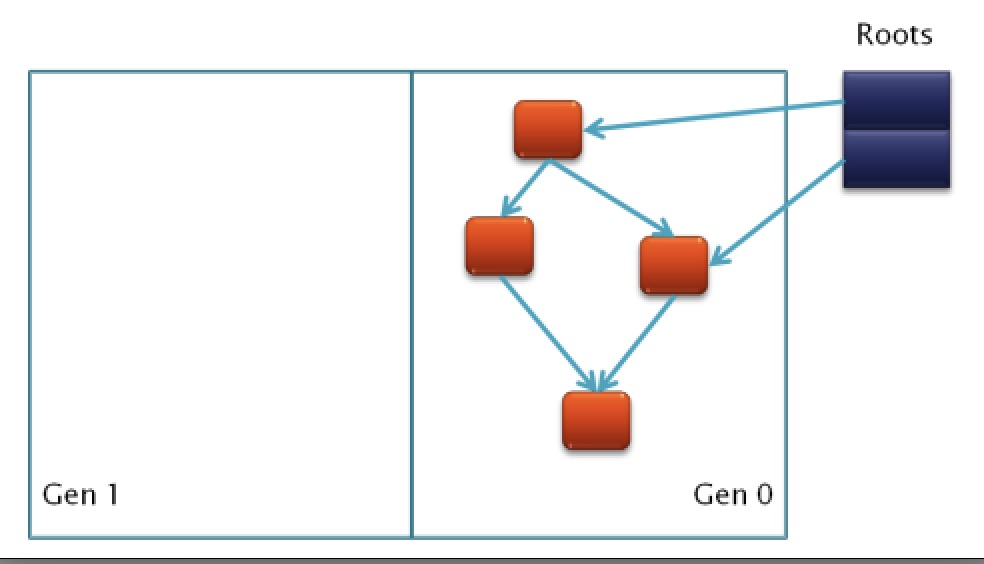
2. 经过一次GC后, 可能有一些对象被回收了, 那么内存空间会变成如下:
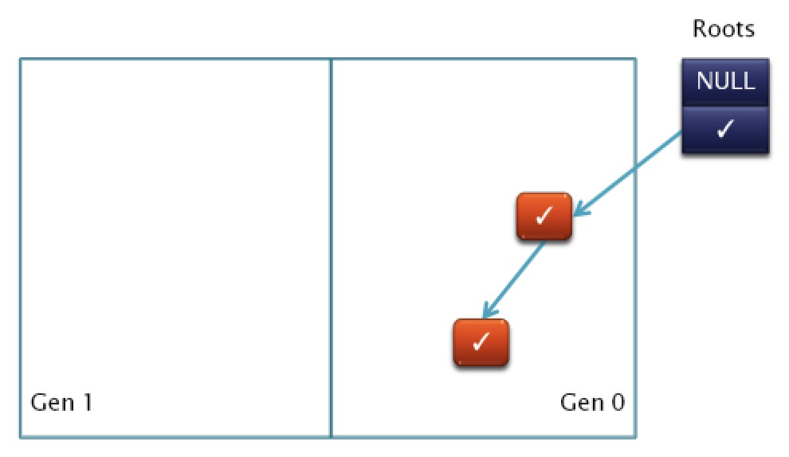
3. 然后这些对象会被提升到GEN1

4. 此时我们假设代码接着运行了一会儿生成了一些新的对象(可以看到有些GEN1引用了GEN0):
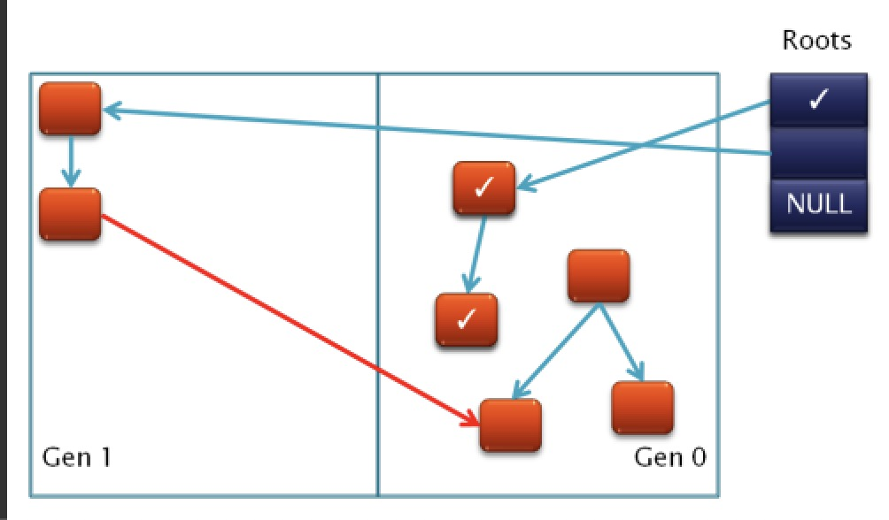
5. 如果我们此时考虑回收GEN1, 我们必须要考虑那些从GEN1引用到GEN0的对象, 如果我们不考虑这个的话, 有些对象就会得不到回收:
注意图中标绿的对象:
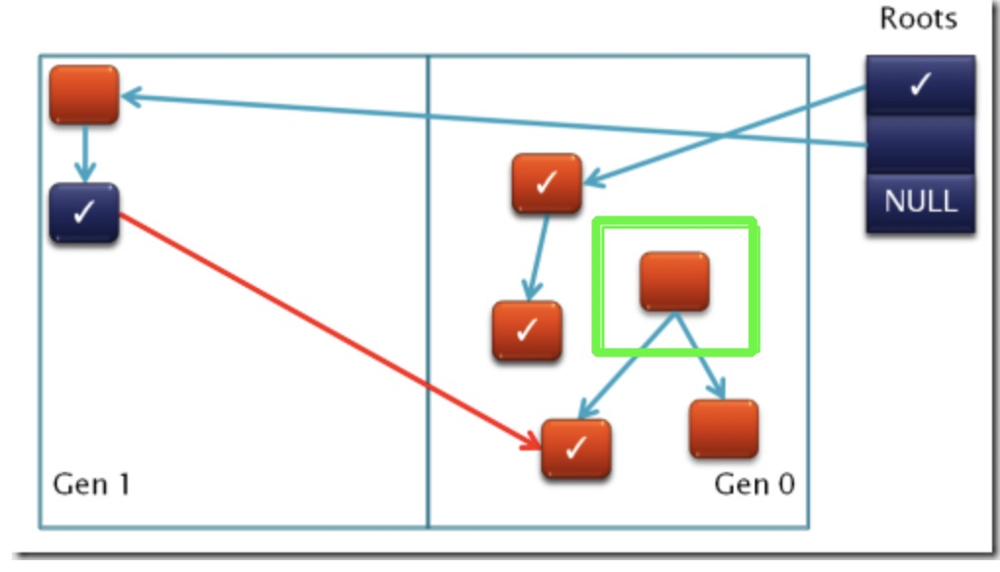
那么现在我们假设我们找到了一种办法能够识别这种情况, 那么我们知道应该把那个GEN1到GEN0的对象也应该当为GCROOTS:
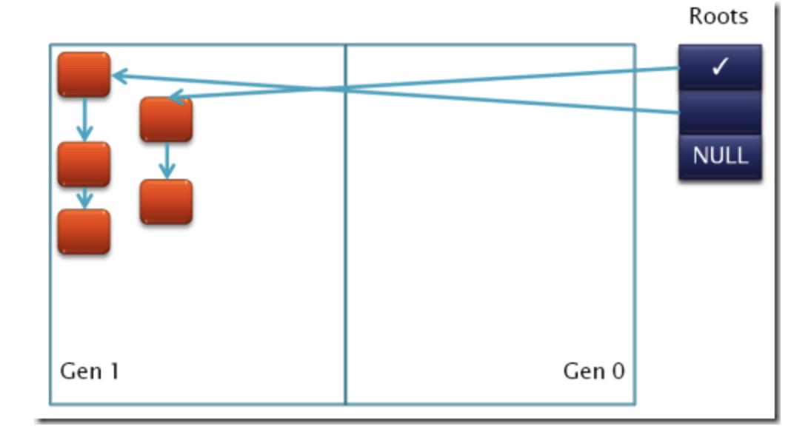
这个技术就是cardtable + write barrier:
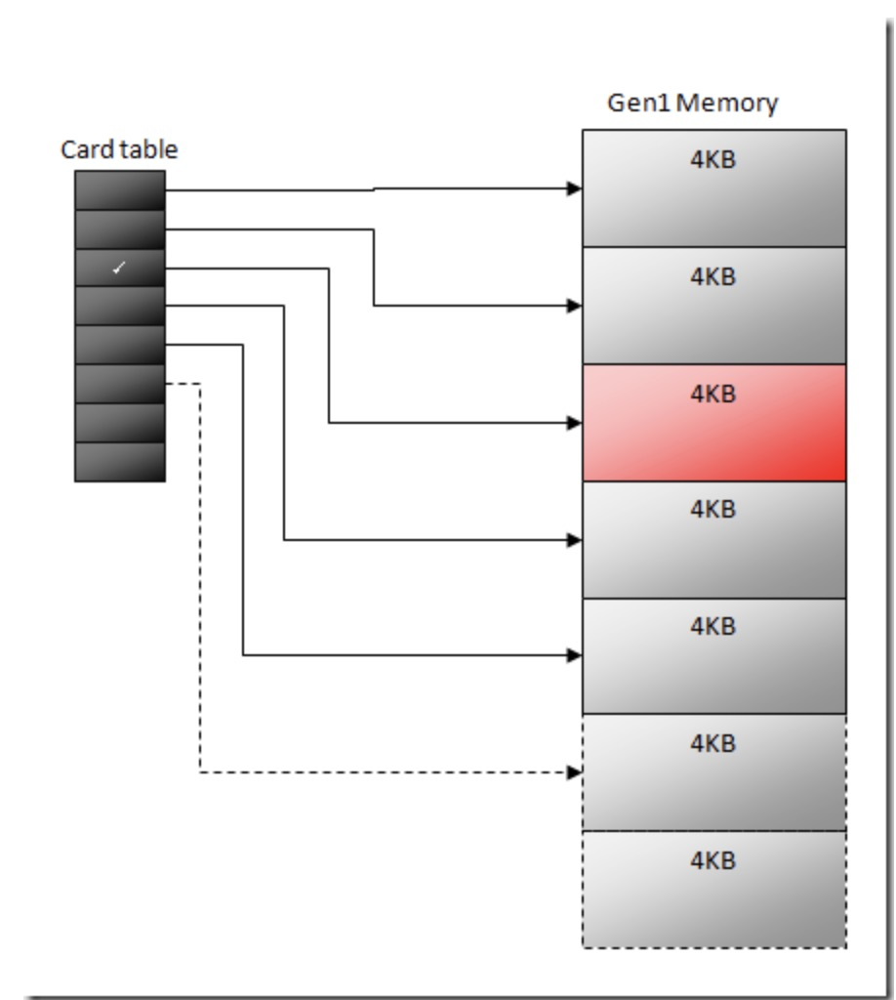
cardtable实际上是一个bit 数组, 标记了GEN1内存(比如分为1个个4KB为单位的block), 如果bit位被置位1(表示为红色)那就说明这个范围的内存是Dirty的(含有对更年轻对象的引用.)<br>
有了这个table后,我们在做GC时, 不止考虑GEN0的GCROOTS, 那些CardTable 中Dirty block中的所有对象都被认为是GCROOTS.

##### Card Table Finish

### **Major GC vs Full GC**
值得注意的是, 无论是JVM规范还是GC得研究论文里面都没有关于这2个的正式定义. 但是第一眼想到的是, 基于我们对Minor GC用于清理年轻代的认识上, 我们不难得出如下定义:
  - **Major GC** 是清理老年代的
  - **Full GC**用来清理整个堆包括年轻代和老年代

不幸的是, 这个可能更加复杂和迷惑. 很多情况下, Major GC是由Minor GC触发的, 想要把它们2个分开是不可能的. 另一方面, 现代的GC算法, 比如G1, 会不停的清理一部分垃圾(所以清理只能是半对的).

从这点我们知道, 我们没必要担心GC是Major 还是 Full GC. 我们更应该关注于这个GC是否会暂停所有的应用线程还是可以和应用线程并发执行.

这个迷惑甚至还体现在JVM的标准工具上. 我们可以通过下面的例子来看下. 我们将比较当某个JVM使用CMS (Concurrent Mark And Sweep) GC时的输出:

让我们先来看下[jstat](https://docs.oracle.com/javase/8/docs/technotes/tools/unix/jstat.html)的输出:

这个片段是从一个JVM启动后的前17s的输出. 根据输出信息, 我们可以知道一共进行了12次Minor GC和2次Full GC用时 50ms. 你可以用GUI工具jconsole或者jvisualvm得出同样的结果.
*译注: YGC: Young GC次数, FGC: Full GC次数, FGCT: Full GC时间, GCT:总GC时间*

在下结论之前, 我们还看下同一个JVM使用另一个工具打印的GC日志(使用*-XX:+PrintGCDetails*我们可以看到一个不同的而且更详细的信息):
```
java -XX:+PrintGCDetails -XX:+UseConcMarkSweepGC eu.plumbr.demo.GarbageProducer
```

基于这个信息我们可以知道, 经过12次Minor GC后, 开始发生一些不同的事情了, 与2次Full GC不同的是, 实际上是一个单次的老年代GC, 并且包含如下阶段:
  - 初始标记阶段(Initial Mark), 耗时:0.0041705s(接近4ms). 该阶段是STW的. 所有的应用线程都被暂停等待初始标记完成.
  - 标记和预清理阶段(Markup and Preclean), 与应用线程并发执行
  - 最终重标记阶段(Final Remark), 耗时:0.0462010s(接近46ms). 该阶段也是STW.
  - 清扫阶段(Sweep). 并发执行而且不会暂停应用线程.

所以我们能从GC日志中看到的, 并不是2次Full GC而是只有1次Major GC来清理老年代.

如果你追求的是延时, 那么从*jstat*的输出就可以让你得出正确的结论. 它正确的列出了两次STW事件耗时总共50ms, 这个会影响当时应用程序的延时. 但如果你尝试优化吞吐量, 你就会被误导了 - *jstat*的输出完全掩盖了并发的工作而只展示了STW 的初始标记和最终重标记阶段.

# GC 算法: 基础
在我们尝试解读GC算法之前, 定义常见的术语和基本原则将更有利于我们理清楚GC实现. 不同的GC算法可能会有不同的实现细节, 但是大多数情况下, 所有的GC算法都关注如下2个领域:
  - 找到所有存活的对象
  - 清除其他所有的东西 -可能死亡的和无用的对象

第一部分, 存活对象的统计都是通过一个叫做**标记Marking**的过程实现的.
## **标记可达对象**
每一个现代的GC都是从找到所有存活的对象开始工作的. 这个概念可以分好的通过下面的图解释(前面讲JVM内存布局的时候说过):

首先, GC定义了一些特殊的对象叫做GC Roots. 可能的GC Roots有:
  - 局部变量和当前执行方法的输入参数
  - 活跃线程
  - 已加载的class的静态域
  - JNI应用

然后, GC开始遍历整个内存来得到一个完整的对象图(object graph). 从GC Roots开始, 然后找到从GC Roots链接的其他对象, 比如实例域. 每个被GC访问到的对象都被**标记**为存活.

活着的对象在上图中被标记为蓝色. 当标记阶段结束时, 所有存活的对象都被标记了. 所有其他的对象(图中的灰色数据结构)都是从GC Roots不可达的对象, 也就暗示了你的应用再也不能使用这些不可达对象了. 这些对象就会被认为是垃圾. GC应该在后面的阶段清除它们.

在标记阶段, 需要注意到以下方面:
  - 应用线程需要被暂停, 因为你没法真正遍历整个图如果它一直在变的话. 当线程被临时暂停, 然后JVM有机会来参与管理(Housekeeping)工作的场景被称为**安全点(Safe Point)**, 同时会导致**Stop The World(STW)**暂停. 安全点可能被各种原因触发, 但是目前为止, GC是最常见的一个. *译注, 还有代码逆优化, 刷新代码缓存, 类从定义(hotswap or instrumentation), 偏向锁撤销, debug操作(比如死锁检测, 堆栈dump)都会触发safepoint* [link](http://blog.ragozin.info/2012/10/safepoints-in-hotspot-jvm.html)
  - 暂停的时间并不取决于整个堆中对象的个数, 也不取决于整个堆的大小, 而是取决于**存活对象**的个数. 所以增大堆的大小并不会直接影响标记阶段的时间.

当**标记**完成后, GC就可以继续下一步-移除不可达对象

## **移除不可达对象**
不同的GC算法可能会常用不同的方式来移除不可达对象, 可分为以下3种:
  - 清扫 Sweeping
  - 压缩 Compacting
  - 拷贝 Copying

### **清扫**
**标记和清扫Mark and Sweep**算法在概念上选用了最简单的方式来处理垃圾 - 忽略它们.这也就是说, 当标记阶段完成后, 所有被未访问到的对象说占用的空间都被认为是空闲的,可以被用来分配新的对象.

这个方法需要一个所谓的**空闲列表free-list** 来记录每个空闲区间和它的大小. 管理空闲列表给对象分配增加了额外的负担. 这个方式的另一个弱点就是-有很多小的空闲区间,但是没有一个足够大的区间来分配对象. 分配还是会失败(也就是Java中的**OutOfMemoryError**)


### **压缩**
**标记,清扫,压缩Mark-Sweep-Compact**解决了前面和清扫的问题--移动所有标记了的(也就是存活的)对象到内存的最前面. 这样做的缺点就是会增加GC暂停的时间,因为我们需要拷贝所有对象到一个新的地方然后更新这些对象的引用. 这样的好处也是显而易见的-- 通过压缩操作后, 新对象的分配变得非常的简单, 只需要通过指针碰撞(pointer bumping)就可以了. 通过这样的方式, 我们总是可以知道可用空间的大小, 而且也没有了碎片问题.


### **拷贝**
**标记和拷贝Mark and Copy**算法与标记和压缩算法很像, 他们都会重新定位所有的存活对象. 一个重要的不同就是copy会将所有存活的对象拷贝到一个完全新的内存区域.标记和拷贝方法有一个优点就是, 它能够在标记的同时进行拷贝操作. 缺点就是, 他需要更多更大的内存空间来容纳存活的对象.


# GC 算法: 实现
现在我们已经回顾了GC算法背后的核心概念, 接下来我们会介绍特定算法的JVM实现. 一个重要的事情我们必须意识到的是, 对于大多数的JVM而言, 我们都需要2个不同的GC算法--一个用来清理年轻代, 一个用来清理老年代.

你可以从JVM中绑定的一系列算法中选择. 如果你不指定, 那么就会用一个平台相关的算法作为默认. 在这个章节, 每个算法的工作原理都会被讲到.

作为一个快速参考, 下面的列表可以帮你快速参考哪些算法是可以组合在一起的. 注意到这个适用于Java 8, 老的Java版本可能有所不同:

如果上面的看起来很复杂, 不用担心, 现实中, 只会用到4个加粗了的组合. 其他的都被废弃了, 不支持或者在现实生活中使用不太实际. 所以下面的章节会介绍如下4种组合的GC算法实现:
 - Serial GC (适宜用于年轻代和老年代)
 - Parallel GC (适用于年轻代和老年代)
 - Parallel New (年轻代) 和 Concurrent Mark and Sweep (CMS) (老年代)
 - G1 适用于年轻代和老年代被没有分开的情况

## **Serial GC**
这个GC对年轻代使用[标记和拷贝](#拷贝), 对老年代使用[标记清扫和压缩](#压缩). 正如名称所暗示的那样, 这2个收集器都是单线程的收集器, 不能并行执行任务. 这2个收集器都会触发STW, 暂停所有应用线程.

这个GC算法不能发挥现代硬件中多核CPU的优势, 不管CPU有多少个核, 在GC时, 都只会使用一个核.
可以通过下面的脚本来使用该GC算法:
```
java -XX:+UseSerialGC com.mypackages.MyExecutableClass
```
这个选项应该在只有几百M大小的堆内存以及在单核CPU环境下使用. 大多数的服务器环境都不太会是单核CPU. 所以当你在有多核的服务器上使用该选项来启动应用时, 会人为的设置一个可用的系统资源的上限. 这会导致限制的资源并不能用来降低延时或者提高吞吐量.

让我们来看下使用Serial GC时, GC 日志会打印什么有用的信息. 你需用通过如下的参数来打开GC日志:
```
–XX:+PrintGCDetails -XX:+PrintGCDateStamps -XX:+PrintGCTimeStamps
```
输出与下图类似:
> 2015-05-26T14:45:37.987-0200: 151.126: [GC (Allocation Failure) 151.126: [DefNew: 629119K->69888K(629120K), 0.0584157 secs] 1619346K->1273247K(2027264K), 0.0585007 secs] [Times: user=0.06 sys=0.00, real=0.06 secs]

> 2015-05-26T14:45:59.690-0200: 172.829: [GC (Allocation Failure) 172.829: [DefNew: 629120K->629120K(629120K), 0.0000372 secs]172.829: [Tenured: 1203359K- >755802K(1398144K), 0.1855567 secs] 1832479K->755802K(2027264K), [Metaspace: 6741K- >6741K(1056768K)], 0.1856954 secs] [Times: user=0.18 sys=0.00, real=0.18 secs]


这段简短的片段给出很多JVM内部发生的信息. 事实上,上面的片段包括2个GC事件, 一个是清理年轻代, 一个是清理整个堆. 让我们从年轻代的GC开始分析.

### **Minor GC**
下面的片段包括一次在年轻代发生的GC事件的信息:

> 2015-05-26T14:45:37.987-0200<sup>1</sup>: 151.126<sup>2</sup>: [GC <sup>3</sup>(Allocation Failure<sup>4</sup>) 151.126: [DefNew<sup>5</sup>: 629119K->69888K<sup>6</sup>(629120K)<sup>7</sup>, 0.0584157 secs] 1619346K->1273247K<sup>8</sup>(2027264K)<sup>9</sup>, 0.0585007 secs<sup>10</sup>] [Times: user=0.06 sys=0.00, real=0.06 secs]<sup>11</sup>

  1. *2015-05-26T14:45:37.987-0200* GC 开始时间
  2. *151.126* GC开始时距JVM启动多少秒
  3. *GC* 标志是Minor 还是 Full GC. 这一次是Minor GC.
  4. *Allocation Failure* GC触发原因. 这一次是因为无法在年轻代中的任何一区分配对象导致.
  5. *DefNew* GC收集器的名字. 这个神秘的名字代表了单线程的标记和拷贝STW收集器被用来在年轻代收集.
  6. *629119K->69888K* 年轻代回收前和回收后的空间.
  7. *(629120K)* 年轻代总大小
  8. *1619346K->1273247K* 堆的回收前和回收后的空间
  9. *2027264K* 总的可用堆空间
  10. *0.0585007 secs* GC耗时
  11. *[Times: user=0.06 sys=0.00, real=0.06 secs]* GC持续时间, 分为如下3类:
          - user GC线程在GC期间所用的总的CPU时间
          - sys  系统调用和等待系统事件的时间
          - real 应用线程总的停顿时间. 因为Serial GC始终只有一个线程, 所以real time等于user+sys.

从上面的片段, 我们可以精确了解JVM在GC过程中的内存消耗. 收集前, 总共有1619346K空间, 其中年轻代用了 629119K. 从此我们可以知道老年代用了 990227K.

从后面的一系列数字, 我们可以知道, 经过这次收集后, 年轻代降低了559231K, 总的堆空间降低了346099K. 从这里我们可以知道有213132K的对象从年轻代提升到了老年代.

下图给出了GC前和GC后内存使用的快照:


### **Full GC**
当我们理解了第一个Minor GC事件后, 让我们来看下日志中的第二个事件:
> 2015-05-26T14:45:59.690-0200<sup>1</sup>: 172.829<sup>2</sup>: [GC (Allocation Failure) 172.829: [DefNew: 629120K->629120K(629120K), 0.0000372 secs<sup>3</sup>]172.829: [Tenured<sup>4</sup>: 1203359K- >755802K<sup>5</sup>(1398144K)<sup>6</sup>, 0.1855567 secs<sup>7</sup>] 1832479K->755802K<sup>8</sup>(2027264K)<sup>9</sup>, [Metaspace: 6741K- >6741K(1056768K)]<sup>10</sup>, 0.1856954 secs] [Times: user=0.18 sys=0.00, real=0.18 secs]<sup>11</sup>

  1. *2015-05-26T14:45:59.690-0200* GC 开始时间
  2. *172.829* GC开始时距JVM启动多少秒
  3. *[DefNew: 629120K->629120K(629120K), 0.0000372 secs* 与前面类似, 因为分配失败Allocation Failure, 在年轻代发生了一次Minor GC. 对于这次收集, 使用DefNew收集器让年轻代的空间从629120K降到了0. 这里JVM报的事件有点问题(报年轻代还是满的), 这是JVM的bug. 这次回收耗时0.0000372秒
  4. *Tenured* 用于老年代的垃圾回收器名字. Tenured 意味着使用了单线程的STW 标记+清扫+压缩 GC回收器.
  5. *1203359K->755802K* 老年代回收前和回收后的空间.
  6. *(1398144K)* 老年代总空间
  7. *0.1855567 secs* 回收老年代所用时间
  8. *1832479K->755802K* 堆的回收前和回收后的空间
  9. *(2027264K)* 当前JVM堆可用总空间
  10. *[Metaspace: 6741K->6741K(1056768K)]* 元空间的垃圾回收, 可以看见这次没有发现垃圾.
  11. *[Times: user=0.18 sys=0.00, real=0.18 secs]* GC持续时间, 分为如下3类:
          - user GC线程在GC期间所用的总的CPU时间
          - sys  系统调用和等待系统事件的时间
          - real 应用线程总的停顿时间. 因为Serial GC始终只有一个线程, 所以real time等于user+sys.

与Minor GC有明显的区别, 这次GC中, 老年代和元空间也被清理了. 下图给出了GC前和GC后内存使用的快照:


## **Parallel GC**
这个GC对年轻代使用[标记和拷贝](#拷贝), 对老年代使用[标记清扫和压缩](#压缩). 年轻代和老年代GC都会触发STW事件, 停止所有应用线程来执行垃圾回收. 这2个收集器在拷贝/压缩阶段都使用了多线程, 这就是为啥是'Parallel'的原因. 通过这种方式降低了垃圾回收的时间.

GC时的线程数可以通过命令行参数*-XX:ParallelGCThreads=NNN*设置. 默认值是机器的核数.

下面的任何一个JVM启动脚本都会选择Parallel GC:
```
java -XX:+UseParallelGC com.mypackages.MyExecutableClass
java -XX:+UseParallelOldGC com.mypackages.MyExecutableClass
java -XX:+UseParallelGC -XX:+UseParallelOldGC com.mypackages.MyExecutableClass
```
Parallel GC 适用于多核系统, 而且你的主要目标是提交吞吐量. 高的吞吐量是通过对系统资源的有效使用实现的:
  - 收集时, 所有的cpu 核都会用来并行清理垃圾, 这缩短了暂停时间
  - 在GC周期间, 收集器不会消耗任何资源.

另一方面, 垃圾收集的所有阶段都不能被中断, 这些收集器当你的应用线程被暂停时,很容易有很长的暂停. 所以如果延时是你的主要目标, 你需要看看下一个GC组合.

现在让我们来看下使用Parallel GC时,GC日志的输出. 下面的GC日志包含了1次Minor GC和一次Major GC:
> 2015-05-26T14:27:40.915-0200: 116.115: [GC (Allocation Failure) [PSYoungGen: 2694440K- >1305132K(2796544K)] 9556775K->8438926K(11185152K), 0.2406675 secs] [Times: user=1.77 sys=0.01, real=0.24 secs]

> 2015-05-26T14:27:41.155-0200: 116.356: [Full GC (Ergonomics) [PSYoungGen: 1305132K- >0K(2796544K)] [ParOldGen: 7133794K->6597672K(8388608K)] 8438926K->6597672K(11185152K), [Metaspace: 6745K->6745K(1056768K)], 0.9158801 secs] [Times: user=4.49 sys=0.64, real=0.92 secs]

### **Minor GC**
第一条事件是年轻代的Minor GC:
> 2015-05-26T14:27:40.915-0200<sup>1</sup>: 116.115<sup>2</sup>: [GC <sup>3</sup>(Allocation Failure<sup>4</sup>) [PSYoungGen<sup>5</sup>: 2694440K- >1305132K<sup>6</sup>(2796544K)<sup>7</sup>] 9556775K->8438926K<sup>8</sup>(11185152K)<sup>9</sup>, 0.2406675 secs<sup>10</sup>] [Times: user=1.77 sys=0.01, real=0.24 secs]<sup>11</sup>

  1. *2015-05-26T14:27:40.915-0200* GC 开始时间
  2. *116.115* GC开始时距JVM启动多少秒
  3. *GC* 标志是Minor 还是 Full GC. 这一次是Minor GC.
  4. *Allocation Failure* GC触发原因. 这一次是因为无法在年轻代中的任何一区分配对象导致.
  5. *PSYoungGen* GC收集器的名字, 这里代表了一个并行的标记拷贝 STW收集器被用来清理年轻代
  6. *2694440K->1305132K* 年轻代回收前和回收后的空间.
  7. *(2796544K)* 年轻代总大小
  8. *9556775K->8438926K* 堆的回收前和回收后的空间
  9. *(1118512K)* 总的可用堆空间
  10. *0.2406675 secs* GC耗时
  11. *[Times: user=1.77 sys=0.01, real=0.24 secs]* GC持续时间, 分为如下3类:
          - user GC线程在GC期间所用的总的CPU时间
          - sys  系统调用和等待系统事件的时间
          - real 应用线程总的停顿时间. 对Parallel GC而言, 该值应大致等于 (user+system)/GC所用线程数.
          - 在这个例子中,使用了8个线程. 因为有些活动没有被并行化, 所以真实值总是比计算的值大一点.

所以, 简单来说, 总的堆占用在收集前是9556775K, 其中年轻代占用2694440K, 老年代也就是6862335K.收集后,年轻代降低了1389308K, 但是总的堆只降低了1117849K. 则意味着有271459K对象从年轻代提升到老年代.
 

### **Full GC**
当我们了解了Parallel GC是如何清理年轻代后, 让我们来接着看下下一条GC日志中是如何清理整个堆的:
> 2015-05-26T14:27:41.155-0200<sup>1</sup>: 116.356<sup>2</sup>: [Full GC<sup>3</sup> (Ergonomics<sup>4</sup>) [PSYoungGen: 1305132K- >0K(2796544K)]<sup>5</sup> [ParOldGen<sup>6</sup>: 7133794K->6597672K<sup>7</sup>(8388608K)<sup>8</sup>] 8438926K->6597672K<sup>9</sup>(11185152K)<sup>10</sup>, [Metaspace: 6745K->6745K(1056768K)]<sup>11</sup>, 0.9158801 secs<sup>12</sup>] [Times: user=4.49 sys=0.64, real=0.92 secs]<sup>13</sup>

  1. *2015-05-26T14:27:41.155-0200* GC 开始时间
  2. *116.356* GC开始时距JVM启动多少秒
  3. *Full GC* 标志这是一次Full GC. 清理整个堆
  4. *Ergonomics* GC发生原因. 这里表示JVM内部决定现在是进行GC的合适时间.
  5. *[PSYoungGen: 1305132K- >0K(2796544K)]* 与前面类似, 一个名叫PSYoungGen的并行标记拷贝收集器被用来收集年轻代.年轻代的占用从1305132K变为了0, 在Full GC后, 整个年轻代都空了出来.
  6. *ParOldGen* 老年代回收器的名字. 一个名叫ParOldGen的标记+清扫+压缩的STW垃圾收集器被用来收集老年代.
  7. *7133794K->6597672K* 老年代回收前和回收后的空间.
  8. *(8388608K)* 老年代总空间
  9. *8438926K->6597672K* 堆的回收前和回收后的空间
  10. *(11185152K)* 总的可用堆空间
  11. *[Metaspace: 6745K->6745K(1056768K)]* 元空间的垃圾回收, 可以看见这次没有发现垃圾.
  12. *0.9158801 secs* GC耗时
  13. *[Times: user=4.49 sys=0.64, real=0.92 secs]* GC持续时间, 分为如下3类:
          - user GC线程在GC期间所用的总的CPU时间
          - sys  系统调用和等待系统事件的时间
          - real 应用线程总的停顿时间. 对Parallel GC而言, 该值应大致等于 (user+system)/GC所用线程数.
          - 在这个例子中,使用了8个线程. 因为有些活动没有被并行化, 所以真实值总是比计算的值大一点.

同样的, 与Minor GC有明显的区别, 这次GC中, 老年代和元空间也被清理了. 下图给出了GC前和GC后内存使用的快照:


## **Concurrent Mark and Sweep**
官方名字是"最多并发的标记和清楚垃圾回收器". 它使用[标记拷贝](#拷贝)STW算法来收集年轻代和最多并发的[标记和清扫](#清扫)算法来清理老年代.

这个收集器被设计来在GC时避免长暂停. 它通过2种方式来实现. 首先, 它不会压缩老年代而是使用空闲列表来管理可回收空间. 其次, 它大多数阶段都是与应用线程并行执行. 这意味着GC不会完全停止应用线程, 而且它也使用多线程来收集. 默认的垃圾线程个数是核数/4.

这个GC算法可以通过如下的选项启用:
```
java -XX:+UseConcMarkSweepGC com.mypackages.MyExecutableClass
```

如果你的主要目标是低时延, 这个组合非常适合在多核系统上. 降低了各个GC 暂停时间, 最直接的影响就是减少了终端用户对应用暂停的感知, 并且让它们觉得反应更加及时了. 因为大多数时间内,只有小部分CPU时间被GC占用来而且没有执行你的应用代码, 所以CMS的吞吐量表现上比Parallel GC会差些.

同前面的一样, 让我们来看下这个GC日志, 其中包含1次Minor 和一次Major GC:
> 2015-05-26T16:23:07.219-0200: 64.322: [GC (Allocation Failure) 64.322: [ParNew: 613404K- >68068K(613440K), 0.1020465 secs] 10885349K->10880154K(12514816K), 0.1021309 secs] [Times: user=0.78 sys=0.01, real=0.11 secs]

> 2015-05-26T16:23:07.321-0200: 64.425: [GC (CMS Initial Mark) [1 CMS-initial-mark: 10812086K(11901376K)] 10887844K(12514816K), 0.0001997 secs] [Times: user=0.00 sys=0.00, real=0.00 secs]

> 2015-05-26T16:23:07.321-0200: 64.425: [CMS-concurrent-mark-start]

> 2015-05-26T16:23:07.357-0200: 64.460: [CMS-concurrent-mark: 0.035/0.035 secs] [Times: user=0.07 sys=0.00, real=0.03 secs]

> 2015-05-26T16:23:07.357-0200: 64.460: [CMS-concurrent-preclean-start]

> 2015-05-26T16:23:07.373-0200: 64.476: [CMS-concurrent-preclean: 0.016/0.016 secs] [Times: user=0.02 sys=0.00, real=0.02 secs]

> 2015-05-26T16:23:07.373-0200: 64.476: [CMS-concurrent-abortable-preclean-start]

> 2015-05-26T16:23:08.446-0200: 65.550: [CMS-concurrent-abortable-preclean: 0.167/1.074 secs] [Times: user=0.20 sys=0.00, real=1.07 secs]

> 2015-05-26T16:23:08.447-0200: 65.550: [GC (CMS Final Remark) [YG occupancy: 387920 K (613440 K)]65.550: [Rescan (parallel) , 0.0085125 secs]65.559: [weak refs processing, 0.0000243 secs]65.559: [class unloading, 0.0013120 secs]65.560: [scrub symbol table, 0.0008345 secs]65.561: [scrub string table, 0.0001759 secs][1 CMS-remark: 10812086K(11901376K)] 11200006K(12514816K), 0.0110730 secs] [Times: user=0.06 sys=0.00, real=0.01 secs]

> 2015-05-26T16:23:08.458-0200: 65.561: [CMS-concurrent-sweep-start]

> 2015-05-26T16:23:08.485-0200: 65.588: [CMS-concurrent-sweep: 0.027/0.027 secs] [Times: user=0.03 sys=0.00, real=0.03 secs]

> 2015-05-26T16:23:08.485-0200: 65.589: [CMS-concurrent-reset-start]

> 2015-05-26T16:23:08.497-0200: 65.601: [CMS-concurrent-reset: 0.012/0.012 secs] [Times: user=0.01 sys=0.00, real=0.01 secs]

### **Minor GC**
GC日志中的一个代表一次年轻代的GC事件:
> 2015-05-26T16:23:07.219-0200<sup>1</sup>: 64.322<sup>2</sup>: [GC <sup>3</sup>(Allocation Failure<sup>4</sup>) 64.322: [ParNew<sup>5</sup>: 613404K- >68068K<sup>6</sup>(613440K)<sup>7</sup>, 0.1020465 secs<sup>8</sup>] 10885349K->10880154K<sup>9</sup>(12514816K)<sup>10</sup>, 0.1021309 secs<sup>11</sup>] [Times: user=0.78 sys=0.01, real=0.11 secs]<sup>12</sup>

  1. *2015-05-26T16:23:07.219-0200* GC 开始时间
  2. *64.322* GC开始时距JVM启动多少秒
  3. *GC* 标志此次GC是Minor还是Full GC. 本次是Minor GC.
  4. *Allocation Failure* GC触发原因. 这一次是因为无法在年轻代中的任何一区分配对象导致.
  5. *ParNew* 使用收集器的名字. 这里表示它是一个并行的标记拷贝STW收集器来收集年轻代的. 被设计来与在老年代使用的CMS共同工作.
  6. *613404K- >68068K* 年轻代在收集前后的使用大小.
  7. *(613440K)* 年轻代总大小
  8. *0.1020465 secs* GC耗时
  9. *10885349K->10880154K* 整个堆在收集前后的大小
  10. *(12514816K)* 整个堆可用空间.
  11. *0.1021309 secs* 在年轻代GC过程中用来标记和拷贝对象所小号的时间.
  12. *[Times: user=0.78 sys=0.01, real=0.11 secs]* GC持续时间, 分为如下3类:
          - user GC线程在GC期间所用的总的CPU时间
          - sys  系统调用和等待系统事件的时间
          - real 应用线程总的停顿时间. 对Parallel GC而言, 该值应大致等于 (user+system)/GC所用线程数.
          - 在这个例子中,使用了8个线程. 因为有些活动没有被并行化, 所以真实值总是比计算的值大一点.

从上面可以看出, 在收集前, 整个堆占用了10885349K, 其中年轻代占用了613404K. 也就是说老年代用了10271945K. 经过收集后, 年轻代占用降低了545336K, 但是整个堆只降低了5195K. 所以有540141K的对象从年轻代提升到老年代.


### **Full GC**
现在你已经比较习惯来阅读GC日志了. 这次会姐要一个完全不同格式的GC事件. 下面冗长的输出包括了在老年代使用CMS GC的不同阶段的输出. 我们会一个一个来看这些阶段相关的日志信息而不是在一次性解释所有的event. 作为回忆, 这个GC事件的完整输出应该像下面这样:
> 2015-05-26T16:23:07.321-0200: 64.425: [GC (CMS Initial Mark) [1 CMS-initial-mark: 10812086K(11901376K)] 10887844K(12514816K), 0.0001997 secs] [Times: user=0.00 sys=0.00, real=0.00 secs]

> 2015-05-26T16:23:07.321-0200: 64.425: [CMS-concurrent-mark-start]

> 2015-05-26T16:23:07.357-0200: 64.460: [CMS-concurrent-mark: 0.035/0.035 secs] [Times: user=0.07 sys=0.00, real=0.03 secs]

> 2015-05-26T16:23:07.357-0200: 64.460: [CMS-concurrent-preclean-start]

> 2015-05-26T16:23:07.373-0200: 64.476: [CMS-concurrent-preclean: 0.016/0.016 secs] [Times: user=0.02 sys=0.00, real=0.02 secs]

> 2015-05-26T16:23:07.373-0200: 64.476: [CMS-concurrent-abortable-preclean-start]

> 2015-05-26T16:23:08.446-0200: 65.550: [CMS-concurrent-abortable-preclean: 0.167/1.074 secs] [Times: user=0.20 sys=0.00, real=1.07 secs]

> 2015-05-26T16:23:08.447-0200: 65.550: [GC (CMS Final Remark) [YG occupancy: 387920 K (613440 K)]65.550: [Rescan (parallel) , 0.0085125 secs]65.559: [weak refs processing, 0.0000243 secs]65.559: [class unloading, 0.0013120 secs]65.560: [scrub symbol table, 0.0008345 secs]65.561: [scrub string table, 0.0001759 secs][1 CMS-remark: 10812086K(11901376K)] 11200006K(12514816K), 0.0110730 secs] [Times: user=0.06 sys=0.00, real=0.01 secs]

> 2015-05-26T16:23:08.458-0200: 65.561: [CMS-concurrent-sweep-start]

> 2015-05-26T16:23:08.485-0200: 65.588: [CMS-concurrent-sweep: 0.027/0.027 secs] [Times: user=0.03 sys=0.00, real=0.03 secs]

> 2015-05-26T16:23:08.485-0200: 65.589: [CMS-concurrent-reset-start]

> 2015-05-26T16:23:08.497-0200: 65.601: [CMS-concurrent-reset: 0.012/0.012 secs] [Times: user=0.01 sys=0.00, real=0.01 secs]

**阶段1:初始标记**这是CMS中一个STW事件, 这个阶段用来收集所有的GC Roots(包括在老年代的GCROOTS 已经年轻代引用了老年代的老年代对象)
> 2015-05-26T16:23:07.321-0200: 64.425<sup>1</sup>: [GC (CMS Initial Mark<sup>2</sup>) [1 CMS-initial-mark: 10812086K<sup>3</sup>(11901376K)<sup>4</sup>] 10887844K<sup>5</sup>(12514816K)<sup>6</sup>, 0.0001997 secs] [Times: user=0.00 sys=0.00, real=0.00 secs]<sup>7</sup>
  1. *2015-05-26T16:23:07.321-0200: 64.425* GC开始时间, 包括绝对时间和相对JVM启动的时间. 后面的阶段与此相同, 为了简单, 不再描述.
  2. *CMS Initial Mark* 阶段名称 - "Initial Mark" -- 用来收集所有GC Roots
  3. *10812086K* 当前老年代占用大小
  4. *(11901376K)* 老年代总可用大小
  5. *10887844K* 当前堆使用空间
  6. *(12514816K)* 当前堆可用空间
  7. *0.0001997 secs] [Times: user=0.00 sys=0.00, real=0.00 secs]* 时间相关
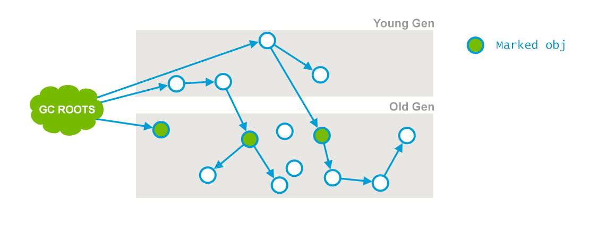

**阶段2:并发标记**在这个阶段垃圾回收器会遍历老年代的所有存活的对象, 从初始标记阶段发现的GC Roots开始. 并发标记阶段正如名称所说那样, 会与应用程序线程并行执行, 也不会暂停应用程序线程.

> 2015-05-26T16:23:07.321-0200: 64.425: [CMS-concurrent-mark-start]

> 2015-05-26T16:23:07.357-0200: 64.460: [CMS-concurrent-mark<sup>1</sup>: 0.035/0.035 secs<sup>2</sup>] [Times: user=0.07 sys=0.00, real=0.03 secs]<sup>3</sup>

  1. *CMS-concurrent-mark* 阶段名称 -- 用来标记老年代中所有存活对象
  2. *0.035/0.035 secs* 显示阶段经过的时间.
  3. *[Times: user=0.07 sys=0.00, real=0.03 secs]* 这里对该阶段意义不大.因为它从开始并发标记开始,并且包含了不止并发标记完成的时间.
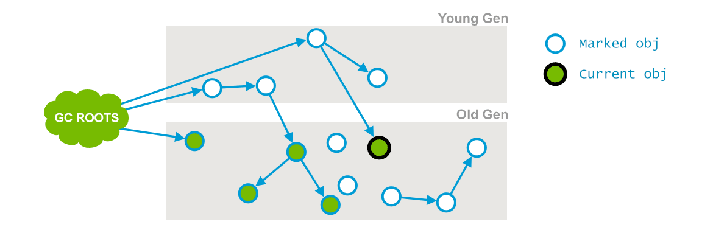

**阶段3:并发预清理**这是一个并发阶段, 与应用线程并行运行而不会暂停他们. 在前一个阶段中, 因为与应用相册那个并行运行,所以某些应用已经改变了. 那些自己的域已经改变了的对象被JVM标记为脏对象也就是Card Marking. 在预清理阶段, 这也对象也被认为是存活的.虽然这可能有误报(垃圾也会被标记为活的),但是重要的是这个避免了实际存活的对象却没有被标记.这个阶段也会做一些最终重标记阶段的准备工作.
> 2015-05-26T16:23:07.357-0200: 64.460: [CMS-concurrent-preclean-start]

> 2015-05-26T16:23:07.373-0200: 64.476: [CMS-concurrent-preclean<sup>1</sup>: 0.016/0.016 secs<sup>2</sup>] [Times: user=0.02 sys=0.00, real=0.02 secs]<sup>3</sup>

  1. *CMS-concurrent-preclean* 阶段名称 - 将前面标记阶段改变的应用当做存活对象
  2. *0.016/0.016 secs* 显示阶段经过的时间
  3. *[Times: user=0.02 sys=0.00, real=0.02 secs]* 这里对该阶段意义不大.因为它从开始并发标记开始,并且包含了不止并发标记完成的时间.

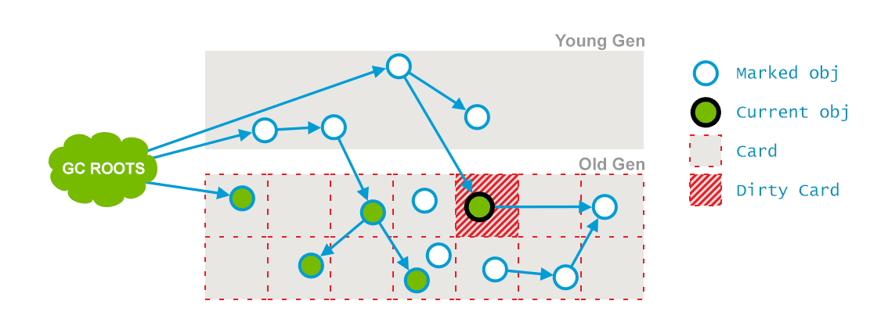

**阶段4:并发可取消预清理**这也是一个并发阶段(不会停止应用线程). 该阶段尝试尽可能减轻最终重标记阶段(STW)的工作压力.该阶段的时间与很多因素有关. 因为它不停地迭代做同一件事直到有取消条件满足(比如迭代次数,总的有意义的工作量,经历时间等)
> 2015-05-26T16:23:07.373-0200: 64.476: [CMS-concurrent-abortable-preclean-start]

> 2015-05-26T16:23:08.446-0200: 65.550: [CMS-concurrent-abortable-preclean<sup>1</sup>: 0.167/1.074 secs<sup>2</sup>] [Times: user=0.20 sys=0.00, real=1.07 secs]<sup>3</sup>

  1. *CMS-concurrent-abortable-preclean* 阶段名称
  2. *0.167/1.074 secs* 阶段持续时间. 有意思的是这里user时间比clock时间小得多. 通常情况下, 我们看到real时间比user时间小, 这就意味着某些工作被并行执行所以逝去的clock时间小于使用的cpu时间. 这里我们看到-只有0.167s的cpu时间, 然后垃圾回收线程就等待了1s左右的时间(不知道等待啥), 什么也没做.
  3. *[Times: user=0.20 sys=0.00, real=1.07 secs]* 这里对该阶段意义不大.因为它从开始并发标记开始,并且包含了不止并发标记完成的时间

**阶段5:最终重标记**这是第二个也是最后一个STW阶段. 该阶段的目的是为了最后标记老年代所有存活的对象.这意味着要从与初始标记一样的GC Roots开始来表里对象, 加上所谓的脏对象(比如那些在前面并发阶段修改过自己域的对象)

通常情况下, CMS会在年轻代尽可能空的情况下运行最终标记, 以此来减少STW阶段一个接着一个的情况.

这个事件看起来比前面的阶段复杂一点:
> 2015-05-26T16:23:08.447-0200: 65.550<sup>1</sup>: [GC (CMS Final Remark<sup>2</sup>) [YG occupancy: 387920 K (613440 K)<sup>3</sup>]65.550: [Rescan (parallel) , 0.0085125 secs]<sup>4</sup>65.559: [weak refs processing, 0.0000243 secs]65.559<sup>5</sup>: [class unloading, 0.0013120 secs]65.560<sup>6</sup>: [scrub symbol table, 0.0008345 secs]65.561: [scrub string table, 0.0001759 secs<sup>7</sup>][1 CMS-remark: 10812086K(11901376K)<sup>8</sup>] 11200006K(12514816K)<sup>9</sup>, 0.0110730 secs<sup>10</sup>] [Times: user=0.06 sys=0.00, real=0.01 secs]<sup>11</sup>

  1. *2015-05-26T16:23:08.447-0200: 65.550* GC开始时间, 包括绝对时间和相对JVM启动的时间
  2. *CMS Final Remark* 阶段名称 - 标记老年代所有存活的对象包括在前面并发阶段创建和修改的引用.
  3. *YG occupancy: 387920 K (613440 K)* 当前年轻代占用空间和容量
  4. *Rescan (parallel) , 0.0085125 secs* 当应用被暂停时,Rescan 完成标记存活的对象. 该阶段是并行执行的, 消耗了0.0085125 secs.
  5. *[weak refs processing, 0.0000243 secs]65.559* 第一个子阶段就是处理弱应用以及消耗的时间和时间戳.
  6. *[class unloading, 0.0013120 secs]65.560*下一个子阶段就是卸载掉不使用的类以及消耗的时间和时间戳.
  7. *[scrub string table, 0.0001759 secs*最后一个子阶段就是清除符号和字符串表.保留了类级别元信息以及internalized 字符串. 消耗时间也记录在内.
  8. *10812086K(11901376K)* 该阶段完成后, 老年代的占用和容量
  9. *11200006K(12514816K)* 该阶段完成后, 整个堆的占用和容量
  10. *0.0110730 secs* 阶段耗时
  11. *[Times: user=0.06 sys=0.00, real=0.01 secs]* 暂停时间.

*这里可以看出弱引用是在MajorGC/CMS时被释放的*
  
经过5个标记阶段,老年代所有存活对象都被标记了.现在收集器将要通过清扫老年代回收这些无用对象占用的空间:
**阶段6:并发清扫** 与应用线程并发执行, 不需要STW. 该阶段目的是清除无用对象并回收其占用空间以备将来之用.

> 2015-05-26T16:23:08.458-0200: 65.561: [CMS-concurrent-sweep-start]

> 2015-05-26T16:23:08.485-0200: 65.588: [CMS-concurrent-sweep<sup>1</sup>: 0.027/0.027 secs<sup>2</sup>] [Times: user=0.03 sys=0.00, real=0.03 secs]

  1. *CMS-concurrent-sweep* 阶段名称 -  清扫未被标记对象以回收空间
  2. *0.027/0.027 secs* 占用时间
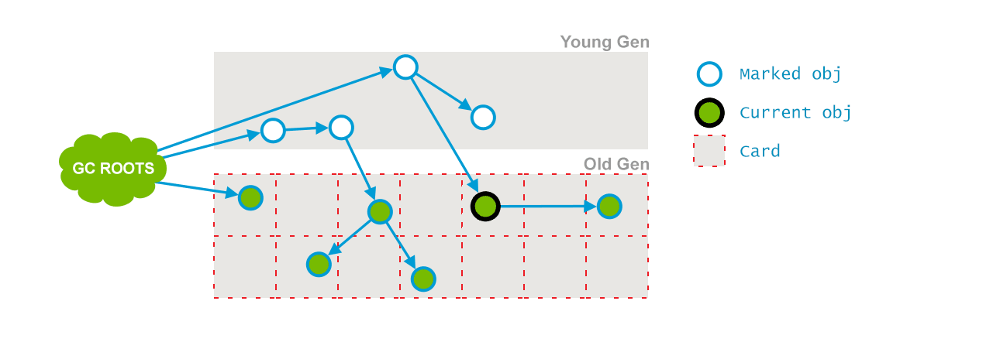

**阶段7:并发重置**并发执行, 重置CMS算法中的内部数据结构,以备下次回收使用
> 2015-05-26T16:23:08.485-0200: 65.589: [CMS-concurrent-reset-start]

> 2015-05-26T16:23:08.497-0200: 65.601: [CMS-concurrent-reset<sup>1</sup>: 0.012/0.012 secs<sup>2</sup>] [Times: user=0.01 sys=0.00, real=0.01 secs]<sup>3</sup>

  1. *CMS-concurrent-reset* 阶段名称 - 重置CMS算法内部数据结构,以备下次收集使用
  2. *0.012/0.012 secs* 占用时间

总而言之, CMS 垃圾回收器通过将大量工作交给并发线程来做而且不需要暂停应用来减少暂停时间. 然而,它也有一些缺点, 最大的就是 **老年代的碎片化问题(使用freelist记录而不compact)** 以及缺乏一个可预测的停顿时间, 这对于一些比较大的堆更为明显.

## **G1 - Garbage First**
G1的主要设计目标就是保证STW的时间和分布都可以很好的预测和配置. 事实上, Garbage-First 是一个*类实时*GC. 也就是你可以设定特定的性能要求. 你可以要求在给定的y ms中, STW的时间不能超过x ms. 比如在任何1s内都不超过5ms. G1 会尽量满足设定的目标(但不能完全肯定, 所以不是绝对实时的).

为了达到这个目标, G1建立在大量的见解之上. 首先, 堆不再需要被分割进连续的2个年轻代和老年代. 取而代之的是, 堆被分为很多(典型的是2048)个小的*堆区域(heap regions)*来存储对象. 每个region都可能是Eden region, 或者Survivor region, Old region. 所有Eden和Survivor 区组合成了逻辑上的年轻代, 所有的Old region组合在一起成了老年代:


这让垃圾收集器不需要每次都收集整个堆,而是每次*增量*的解决问题:每次只会有所有region集合的一个子集会被考虑, 称为*收集集合Collection set*.年轻代的所有region在每个暂停的时候都被收集,但是老年代只有一部分会被收集:

在并发阶段的另一个新奇的事就是G1会估计每个region中包含的存活对象的个数.这被用来构建Collection set:**包含最多垃圾的region总是优先被收集**. 这个是名称*Garbage-first*的由来.

像下面这样来使用G1 GC:
```
java -XX:+UseG1GC com.mypackages.MyExecutableClass
```

### **Evacuation Pause: Fully Young**
在引用的开始阶段, G1不能从还没执行过的并发阶段知道任何额外的信息, 所以它最开始工作在*fully-young*模式.当年轻代满了后,应用线程被暂停,年轻代regions的活跃对象被拷贝到Surivior regions(任何其他空闲的region因此就变成了Survivor).

拷贝的过程称为Evacuation(*译注:意为疏散*). 这与我们前面讲到的年轻代的收集器完全一样.Evacuation Pause的GC 日志非常长, 所以这里简单期间, 我们只留下了一些与第一次fully-young Evacuation Pause相关的日志. 我们随后讲到并发阶段时还会详细讲到. 除此之外, 因为日子很大, 并发阶段和其他Other阶段会在单独的段落讲到:
> 0.134: [GC pause (G1 Evacuation Pause) (young), 0.0144119 secs]<sup>1</sup>

>  [Parallel Time: 13.9 ms, GC Workers: 8]<sup>2</sup>

>  ...<sup>3</sup>

>  [Code Root Fixup: 0.0 ms]<sup>4</sup>

>  [Code Root Purge: 0.0 ms]<sup>5</sup> [Clear CT: 0.1 ms]

>  [Other: 0.4 ms]<sup>6</sup>

>  ...<sup>7</sup>

>  [Eden: 24.0M(24.0M)->0.0B(13.0M)<sup>8</sup>

>  Survivors: 0.0B->3072.0K <sup>9</sup> 

>  Heap: 24.0M(256.0M)->21.9M(256.0M)]<sup>10</sup>

>  [Times: user=0.04 sys=0.04, real=0.02 secs]<sup>11</sup>

  1. *0.134: [GC pause (G1 Evacuation Pause) (young), 0.0144119 secs]* G1暂停只清理年轻代的region. 这个暂停在JVM启动后134ms开始,暂停时间0.0144s.
  2. *[Parallel Time: 13.9 ms, GC Workers: 8]* 表示有13.9ms (real time)用于后面的8个线程的GC活动
  3. *...* 简单起见,省略了, 后面会讲到
  4. *Code Root Fixup: 0.0 ms* 用于释放管理并发活动的数据结构, 该值应该总是0. 这是顺序执行的.
  5. *[Code Root Purge: 0.0 ms]* 清理更多的数据结构, 应该会很快. 但不一定是0. 这是顺序执行的.
  6. *[Other: 0.4 ms]* 混杂的其他活动时间, 其中的许多也是并行的.
  7. *...* 后面会讲到
  8. *[Eden: 24.0M(24.0M)->0.0B(13.0M)* 暂停前后Eden的使用量和容量
  9. *Survivors: 0.0B->3072.0K * 暂停前后, Survivor的使用量.
  10. *Heap: 24.0M(256.0M)->21.9M(256.0M)]* 暂停前后, 堆得使用量和容量.
  11. *[Times: user=0.04 sys=0.04, real=0.02 secs]*GC持续时间, 分为如下3类:
                  - user GC线程在GC期间所用的总的CPU时间
                  - sys  系统调用和等待系统事件的时间
                  - real 应用线程总的停顿时间. 该值应大致等于 (user+system)/GC所用线程数.
                  - 在这个例子中,使用了8个线程. 因为有些活动没有被并行化, 所以真实值总是比计算的值大一点.

大多数繁重的工作都被多个专有GC线程完成, 下面的日志描述了它们的活动:
> [Parallel Time: 13.9 ms, GC Workers: 8]<sup>1</sup>

>   [GC Worker Start (ms)<sup>2</sup>: Min: 134.0, Avg: 134.1, Max: 134.1, Diff: 0.1]

>   [Ext Root Scanning (ms)<sup>3</sup>: Min: 0.1, Avg: 0.2, Max: 0.3, Diff: 0.2, Sum: 1.2] 

>   [Update RS (ms): Min: 0.0, Avg: 0.0, Max: 0.0, Diff: 0.0, Sum: 0.0]

>   >  [Processed Buffers: Min: 0, Avg: 0.0, Max: 0, Diff: 0, Sum: 0]

>   [Scan RS (ms): Min: 0.0, Avg: 0.0, Max: 0.0, Diff: 0.0, Sum: 0.0]

>   [Code Root Scanning (ms)<sup>4</sup>: Min: 0.0, Avg: 0.0, Max: 0.2, Diff: 0.2, Sum: 0.2]

>   [Object Copy (ms)<sup>5</sup>: Min: 10.8, Avg: 12.1, Max: 12.6, Diff: 1.9, Sum: 96.5]

>   [Termination (ms)<sup>6</sup>: Min: 0.8, Avg: 1.5, Max: 2.8, Diff: 1.9, Sum: 12.2]

>   >   [Termination Attempts<sup>7</sup>: Min: 173, Avg: 293.2, Max: 362, Diff: 189, Sum: 2346]


>   [GC Worker Other (ms)<sup>8</sup>: Min: 0.0, Avg: 0.0, Max: 0.0, Diff: 0.0, Sum: 0.1]

>   [GC Worker Total (ms)<sup>9</sup>: Min: 13.7, Avg: 13.8, Max: 13.8, Diff: 0.1, Sum: 110.2]

>   [GC Worker End (ms)<sup>10</sup>: Min: 147.8, Avg: 147.8, Max: 147.8, Diff: 0.0]]       

  1. *[Parallel Time: 13.9 ms, GC Workers: 8]* 表明下面的活动耗时13.9ms(clock), 由8个线程并行执行.
  2. *GC Worker Start (ms)* GC开始工作时间. 与暂停开始时间对应, 如果Min和Max相差很大,可能意味着(1)GC线程过多.或者(2)该机器上有其他的进程从GC进程*盗取*了很多cpu时间.
  3. *Ext Root Scanning (ms)* 扫描其他Roots(非堆)消耗了多少时间. 包括类加载器, JNI应用, JVM System Roots. 单位是clock 时间. "Sum"是cpu 时间.
  4. *Code Root Scanning (ms)* 扫描从实际代码(本地变量)引出的Roots的时间.
  5. *Object Copy (ms)* 从收集的regions里面拷贝存活的对象消耗的时间
  6. *Termination (ms)* GC workers用时多久来保证可以停止下来而且没有更多的事情需要做. 然后真的停止下来.
  7. *Termination Attempts* GC workers尝试终止的次数. 如果worker发现还有更多的工作需要做时,就尝试停止就被认为是一次失败的终止尝试. 因为它终止的太早了.
  8. *GC Worker Other (ms)* 其他混杂的活动的时间. 没有在日志中体现的阶段.
  9. *GC Worker Total (ms)* workers工作的总时间.
  10. *GC Worker End (ms)* workers 停止工作的时间戳. 正常情况他们应该大致相等. 否则意味着有太多的线程hangs或者有噪声.
  

除此之外, 在Evacuation pause期间,有一些其他混杂的活动. 这里我们只会涉及其中的一部分. 其他的会在后面讲到.

> [Other: 0.4 ms]<sup>1</sup>
>   [Choose CSet: 0.0 ms]
>   [Ref Proc: 0.2 ms]<sup>2</sup>
>   [Ref Enq: 0.0 ms]<sup>3</sup>
>   [Redirty Cards: 0.1 ms] [Humongous Register: 0.0 ms] [Humongous Reclaim: 0.0 ms]
>   [Free CSet: 0.0 ms]<sup>4</sup>

  1. *[Other: 0.4 ms]* 其他活动的耗时, 大多数都是并行的.
  2. *[Ref Proc: 0.2 ms]* 处理非强引用的时间: 清理或者决定是否需要清理
  3. *[Ref Enq: 0.0 ms]* 将非强引用放入对应的ReferenceQueue的时间.
  4. *[Free CSet: 0.0 ms]* 返回收集集合中的释放了的region的时间. 这些集合变为空闲可用.
  
### **并发标记** 
G1构建于前面章节的很多概念之上. 所以在继续之前,请确保你对前面的知识有充分的理解.虽然有很多方法, 但是并发标记的目标却是类似的. G1并发标记使用了一个叫Snapshot-At-The-Beginning/SATB的方法在标记阶段的开始来标记所有存活的对象, 即便它们一会儿会变成垃圾. 关于哪些对象是存活的信息可以用来构建每个region的存活统计, 以便选出高效的回收集合.
这些信息随后也被用来在老年代上进行垃圾回收. 如果标记发现某个region只有垃圾或者在老年代的STW evacuation pause阶段, 那么它可以完全并行.

并发标记在整个堆占用足够大时开始执行. 默认值是45%, 可以通过JVM选项**InitiatingHeapOccupancyPercent**设置. 与CMS类似, G1中的并发标记也包含很多阶段, 其中一些是完全并行的, 其中一些需要暂停应用线程.


**阶段1:初始标记Initial Mark**  这个阶段会标记从GC roots直接可达的对象, 在CMS中, 它需要一个单独的STW暂停, 但是在G1中, 它一般都在Evacuation Pause 阶段运行(*译注:原文piggy-backed on an Evacuation Pause*), 所以它的副作用很小. 从GC日志上可以看到在Evacuation Pause有一个额外的*(initial-mark)*标记

> 1.631: [GC pause (G1 Evacuation Pause) (young) (initial-mark), 0.0062656 secs]

**阶段2:Root区扫描 Root Region Scan** 在这个阶段, 会标记所有的从所谓的根区可以到达的对象. 比如那些不是空的而且我们必须在标记阶段的中间结束收集的Regions. 因为在并发标记阶段来移动对象会导致麻烦, 所以这个阶段必须在下一个Evacuation Pause之前完成. 如果Evacuation Pause必须提前开始, 它必须提前请求中断root region scan, 然后等root region scan完成. 在当前实现中, root regions是survivor regions:他们是年轻代的第一部分,而且可以再下次Evacuation Pause得到很好的收集.

> 1.362: [GC concurrent-root-region-scan-start]

> 1.364: [GC concurrent-root-region-scan-end, 0.0028513 secs] 
 
**阶段3:并发标记Concurrent Mark**这个阶段与CMS中的很像:它遍历对象图,并且在一个特殊的位图中标记访问到的对象.  为了保证SATB的语义, G1 垃圾收集器会要求所有应用线程对对象图的并发修改都会离开原来的引用来达到标记的目的.

这是通过Pre-Write 屏障实现的(不要与Post-Write屏障混淆,我们后面可能会说到), 它的功能是:无论什么时候, 在G1 并发标记运行, 当你想写一个域,会在所谓的log-buffers中保存前面的引用,来方便并发标记线程使用.
 
**阶段4:重标记Remark**这是一个STW阶段 与CMS类似, 完成标记过程. 对G1而言, 它会停止应用线程来停止并发更新日志流入和处理剩余的一小部分, 然后在并发标记阶段初始化后,标记所有其他还是没被标记的存活对象. 这个阶段也会执行一些额外的清理操作,比如应用处理(参考Evacuation Pause日志)或者类卸载.
> 1.645: [GC remark 1.645: [Finalize Marking, 0.0009461 secs] 1.646: [GC ref-proc, 0.0000417 secs] 1.646: [Unloading, 0.0011301 secs], 0.0074056 secs] [Times: user=0.01 sys=0.00, real=0.01 secs]

**阶段5:清理Cleanup**这个阶段为下个Evacuation Pause阶段做准备,统计堆regions中的存活对象,根据预期的GC效率排序. 也会执行一些house-keeping活动来保证下次编发标记时内部状态正确.

最后重要的一点是, 不包含任何存活对象的region在该阶段被回收. 这个阶段的部分过程是并发的, 比如空region回收还有大多数的活跃性计算. 但是它还是需要一个短暂的STW事件来最终化图像当应用线程没有来捣乱. 这样的STW的日志看起来会是下面这个样子:
> 1.652: [GC cleanup 1213M->1213M(1885M), 0.0030492 secs] [Times: user=0.01 sys=0.00, real=0.00 secs]

当发现了某些只包含垃圾的region是, STW暂停的日志可能稍许不同:
> 1.872: [GC cleanup 1357M->173M(1996M), 0.0015664 secs] [Times: user=0.01 sys=0.00, real=0.01 secs]

>  1.874: [GC concurrent-cleanup-start]

>  1.876: [GC concurrent-cleanup-end, 0.0014846 secs]


### **Evacuation Pause: Mixed**
值得高兴的情况是, 并发清理可以释放老年代的整个regions. 但是并不是每次都是这样, 当并发标记成功结束后,G1会预定一个混合的收集来收集年轻代regions的垃圾,也会在收集集合中加入一部分老年代的regions.

一个混合的Evacuation Pause并不总是并发标记阶段结束后立即开始. 有一系列的规则和启发式算法来决定这个. 比如, 可以释放掉老年代的一大部分空间, 那么就没必要做这个了.

因此,就是在并发标记结束和混合Evacuation Pause直接加入很多fully-young的Evacuation Pause.

具体放入收集集合的老年代区的region,以及它们被加入的顺序都基于一系列的规则选择出来的. 这些规则包括:应用设定的软的实时性能指标, 存活统计以及并发标记阶段垃圾回收的效率, 还有一系列可配的JVM 选项. 混合式收集大体上与我们前面看到fully-young相同, 但这次我们讲到新的对象*remembered sets*.

remembered sets 用来支持在不同heap regions上的独立收集. 比如当收集region A,B,C, 我们只需要知道从region D和E中是否有引用到它们来决定它们的存活性.因为遍历整个堆会消耗很久的时间并且打破了我们增量收集的意义, 所以在G1中也采用了与在其他算法中采用Card Table来独立收集年轻代区域类似的优化算法, 叫做remember sets.


如下图所示, 每个region都有一个RSet保存从其他region到这个region中对象的引用. 这些对象会被当做额外的GC roots. 注意在并发标记阶段, 老年代被认为是垃圾的对象会被忽略, 即便有外部对象还在引用它们, 因为它们的对象也会被当做垃圾.

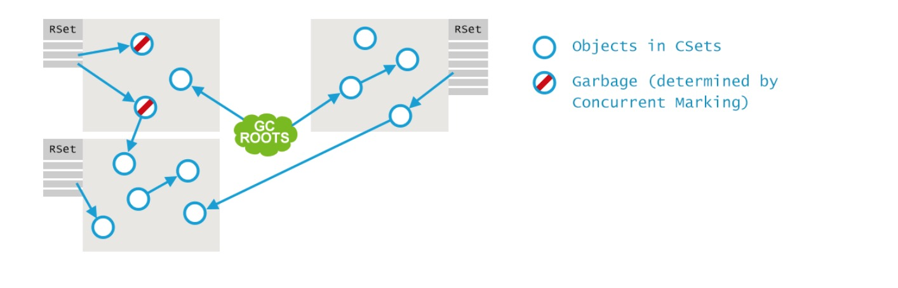

接下来发生的与其他收集器类似:多个并行的GC线程会找出哪些是存活的哪些是垃圾.
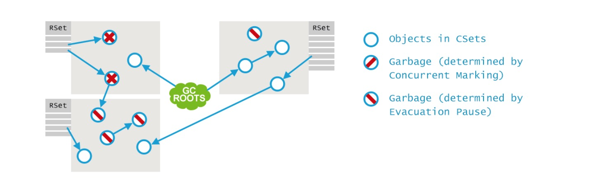
最后, 所有存活对象会被移动到survivor区(如有必要创建新的).所有的空region会被释放后被用来存放对象.
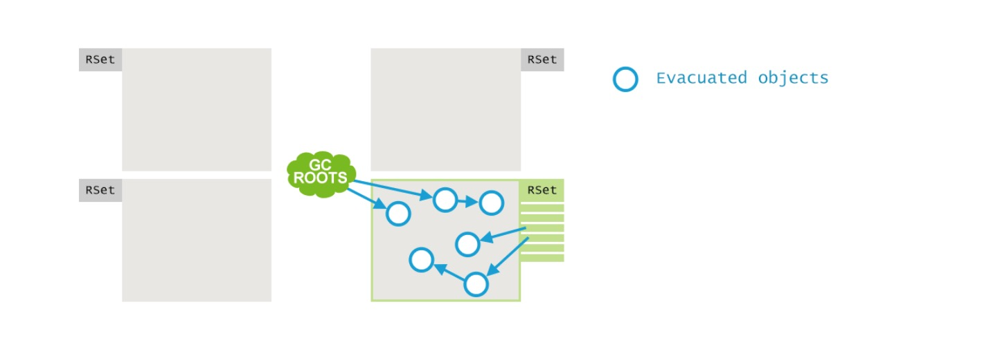

为了在应用程序运行期间维护RSets, 任何时候对域的更新都会触发一个Post-Write屏障. 如果关联的引用是跨region的, 比如从一个region到另一个region,一个对应的记录也会在目标region的RSet中添加. 将记录(cards)加入到RSet是异步的并应用了很多优化.简单来说它用Write屏障来将脏记录放到本地buffer中, 一个特殊的GC线程会选择这些记录,然后传播信息给其他region的RSet.

在mix 模式下,GC日志会包含一些与fully-young模式不同的记录:
> [Update RS (ms)<sup>1</sup>: Min: 0.7, Avg: 0.8, Max: 0.9, Diff: 0.2, Sum: 6.1]

> [Processed Buffers<sup>2</sup>: Min: 0, Avg: 2.2, Max: 5, Diff: 5, Sum: 18]

> [Scan RS (ms)<sup>3</sup>: Min: 0.0, Avg: 0.1, Max: 0.2, Diff: 0.2, Sum: 0.8]

> [Clear CT: 0.2 ms]<sup>4</sup>

> [Redirty Cards: 0.1 ms]<sup>5</sup>


  1. *Update RS (ms)* 因为RSet是并行处理, 所以必须保证在真正垃圾收集之前,被缓冲着的脏页会被处理. 如果数目很多, GC线程会处理不过来,它可能是因为有大量的域更新或者没有足够的CPU资源.
  2. *Processed Buffers* 每个GC线程处理了多少个local buffers
  3. *Scan RS (ms)* 扫描从RSet中流入的对象耗时多久.
  4. *[Clear CT: 0.2 ms]* 清理card table中的cards消耗的时间. 清理只会简单移除*dirty*标记状态(当一个域被修改时,该值会被设置). 这个标记会被RSet使用.
  5. *[Redirty Cards: 0.1 ms]* 在card table中标记是dirty的位置所消耗的时间. 位置在对发生突变时,GC自己指定的, 比如enqueue引用的时候.

### **总结**
这个应该已经给了你一个对G1足够基础的概念. 当然,还有很多其他的细节我们没有提到, 比如如何处理[大对象](#大对象). 综上所述, G1是当前HotSpot中最科技领先的产品环境可用的垃圾回收器,在它的基础上,它还在被HotSpot工程师不断优化,和在新版本java中加入新的特性.
可以看到, G1解决了CMS中的很多问题, 比如可预期的暂停和堆碎片清理. 对于一个不限制CPU使用当对每个时延都非常敏感的应用来说,G1可以说是最合适的,尤其是那些使用了最新版本java的应用. 然而,这些时延上的提升并不是免费的:吞吐量上的消耗大多数来自于而外的写屏障和更多的活跃的后台线程. 所以如果应用是有吞吐量要求或者消耗了100%CPU, 并且不关心独立操作的暂停时间, 或许CMS或者Parallel 是更好的选择.

选择正确的GC算法和配置的唯一办法就是不断地犯错和常识. 但是我们会在下一章给出通用的指导意见.

注意G1可能会是Java 9的默认GC: [ http://openjdk.java.net/jeps/248](http://openjdk.java.net/jeps/248)

## **Shenandoah**
我们已经大概看了HotSpot中产品可用的GC算法, 你可以随时使用它们, 还有另外一个正在研究的,叫所谓的超低暂停时间的GC.它的设计适用于有大型堆的多核系统上,并且能够达到管理100GB及以上的堆可以低于10ms的暂停甚至更短.取舍的就是:吞吐量, 预期与无GC暂停时相比,不降低超过10%的吞吐量.

因为这个新的算法还没有被作为产品可用发布出来, 我们不会去讨论它的实现细节. 但是,它也是基于前面的很多观点构建的, 比如并发标记和增量收集.但是它做这些的方式有所不同.它不将堆分为多个代,而是作为一个完整的空间.是的,Shenandoah不是一个分代收集器.这样可以避免使用card tables 或者remembered sets.它使用前向指针和一个Brooks 风格的读屏障来允许并发拷贝存活对象,以此来减少暂停的数量和时间.

更多更及时的Shenandoah可以从互联网访问到,比如博客:[https://rkennke.wordpress.com/](https://rkennke.wordpress.com/)


# GC 优化: 基础
GC优化与其他性能优化活动一样.很容易陷入随机调整200多个GC相关的参数或者开始改变代码的某个部分的陷阱.相反的,采用一个简单的流程可以保证你确实是在朝正确的方向前进:

 1. 设置性能目标
 2. 运行测试
 3. 衡量测试结果
 4. 比较结果和目标
 5. 如果没达到目标,做出改变,然后重新测试

所以, 第一步, 我们需要设定一个关于GC的清晰目标.这些目标会分为3类,也是大多性能监测和管理相关的主题:
 1. 时延
 2. 吞吐量
 3. 容量

在解释这3类的基本概念后, 我们会演示如何将这些目标应用于GC中, 如果你已经熟悉了时延,吞吐量,容量, 你可以选择跳过这个章节

## **核心概念** 
让我们从一个制造业的组装流水线来举例. 流水线用来将准备好的组件组装成自行车.自行车在这条线上是线性组装的. 检测流水线的活动, 我们测得,完成一个自行车从进入流水线到组装完成落地需要**4小时**. 


继续观察,我们发现自行车是一分钟接着一分钟被组装出来, 1天24小时不间断,没有维护窗口. 那么我们可以预测**任何一小时内,这条流水线可以组装60辆自行车**.

通过前面2次观察,我们可以得出关于流水线的重要信息:
- 时延: 4小时
- 吞吐量: 60车/小时

注意到,时延是时间单位(与具体任务相关的)-可以从纳秒到千年都可以. 一个系统的吞吐量是在单位时间内能够完成的操作数量.操作可以是任何特殊系统相关的. 在这个例子里,选择的单位时间是小时,操作是组装自行车.

有了这2个概念之后,我们来对这家工厂做一个性能优化. 现在流水线已经持续保持4小时的时延和60车/小时的生产速度很久了. 让我们假设下面这个场景, 有一天,销售部门很成功的拿到了很大的订单,然后自行车的需求数量翻倍了,与平常的60*24=1440 辆相比翻倍了. 工厂再也不能满足了,必须做些什么事了.

工厂管理员似乎正确发现了系统时延其实不重要,他跟应该关注1天内自行车的生产数量.得出结论之前,我们假设这个管理员很有钱,而且他马上就要通过必要的增加容量来提高吞吐量了.

结果就是,每天我们可以看见2条不同的流水线在同时工作.每天流水线每天都能组装相同的自行车. 这么做之后,我们假想的工厂已经将每天生产的自行车数量翻倍了.重要的是, 我们并没有降低每个自行车的组装时间-它依然只需要4个小时来完成组装.

在上面的例子中,我们已经做了一次性能优化,并且影响了**吞吐量**和**容量**.所以在任何好的参考中,我们都是测量当前性能,设置新的目标,优化影响相关方面的因素来达到目标.

在这个例子中,我们做的最重要的决定是--只关注于提高吞吐量而不是降低时延. 当提高吞吐量时,我们也需要增加系统的容量. 我们需要2条而不是1条流水线来组装需要的数量的自行车. 所以,在这个例子中,提高吞吐量并不是免费的,需要增加相应设备来满足增长的吞吐量需求(Scale-out).

当前我们也有一个重要的选择方案. 看起来不相关的系统时延实际上也是这个问题的一个解决方案.如果流水线的时延从1分钟减少到30秒,那么我们会瞬间得到同样的吞吐量而不需要提高容量.

无论如何,降低时延是否可能或者实际都不重要. 重要的是,这与软件工程中的概念十分相似--你大多数情况下解决性能问题时都需要在2个解决方案之间选择. 你要么提供更多的设备或者花时间来提高代码性能.

### **时延Latency**
GC的时延目标都是从一般的时延需求得来的.一般的时延需求都可以描述为下面几种:
- 所有的用户事务必须在小于10s内响应
- 90% 的发票支付必须在3s内完成
- 推荐商品必须在100ms内绘制显示

当面对上面类似的性能目标时,我们都需要保证GC暂停不会再事务期间共享太多的时间以致达不到目标. "太多"意味着这是引用相关的,而且需要考虑到其他外部因素对实验的影响, 比如外部数据资源的RRT, 锁竞争或者Safe points等.

让我们假设我们的性能目标是:90%的应用事务都在小于1000ms内完成,而且没有事务超过10000ms. 除此之外,我们还假设GC暂停时间不能超过10%. 由此,我们可以推断,90%的GC暂停都要在100ms内完成, 没有哪个GC暂停会超过1000ms.为了简单期间,我们会忽略在同一事务中可能发生的多个暂停.
 
上面我们已经清楚了我们的需求, 下一步就是如何测量暂停时间.有很多工具我们会在随后的章节(工具)[#GC 优化: 工具]讲到. 在这里,我们先看下GC日志来判断GC暂停. 这个信息存在于多个日志片段中,所以我们先看下哪些时间数据是相关的:

>  2015-06-04T13:34:16.974-0200: 2.578: [Full GC (Ergonomics) [PSYoungGen: 93677K- >70109K(254976K)] [ParOldGen: 499597K->511230K(761856K)] 593275K->581339K(1016832K), [Metaspace: 2936K->2936K(1056768K)], 0.0713174 secs] [Times: user=0.21 sys=0.02, real=0.07 secs

在上面的日志中,在6月4号13:34:16触发了一个GC暂停, 发生在JVM启动2.578s后.
这个事件暂停了应用线程**0.0713174s**. 虽然它用了210ms的多核cpu时间,但是更重要的还是它暂停应用的时间, 这个例子中是Parallel GC在多核机器上一共用了差不多70ms. 这个暂停时间已经满足我们的100ms阈值.

从所有的GC暂停中,我们都可以得到类似的信息,那么我们就可以将这些信息聚合在一起来判断我们是否达到或者满足了我们预定的要求.

### **吞吐量Throughput**
吞吐量要求与时延要求不同. 唯一相同的地方就是吞吐量需求也需要从一般吞吐量需求得出. 一般的吞吐量需求与下面类似:
- 某解决方案必须支持1000000单/每天
- 该方案必须支持1000用户,每个用户每5-10s调用A,B或者C功能一次
- 所有用户的周统计必须在每个周六的下午12点到凌晨6点完成.

所以, 与要求单个操作不同, 吞吐量的要求指定了在一个给定时间范围系统必须完成的操作个数. 与时延要求类似,GC优化时需要决定在GC上能够花多少时间. 占用时间的比例也是应用相关的. 但是,一般来讲, 任何超过10%的时间都是可疑的.

了解了需求后, 我们需要获取真正有用的信息了.我们还是用前面的rizhi1:
> 2015-06-04T13:34:16.974-0200: 2.578: [Full GC (Ergonomics) [PSYoungGen: 93677K- >70109K(254976K)] [ParOldGen: 499597K->511230K(761856K)] 593275K->581339K(1016832K), [Metaspace: 2936K->2936K(1056768K)], 0.0713174 secs] [Times: user=0.21 sys=0.02, real=0.07 secs

这次我们关心的是user 和 system 时间. 在这里,我们看到是23ms(21 + 2 ms)是GC占用CPU的时间. 更重要的是, 这是在一个多核机器上运行, 也就是整个STW时间是**0.0713174s**. 

与前面的类似, 我们需要检查每分钟STW的时间. 如果每分钟内,总的GC暂停时间没超过6s就满足要求.

### **容量Capacity**
容量需求在时延和吞吐量的限制下加上了其他限制. 这些限制一般是计算资源的使用. 这些限制一般与下面的类似:
- 系统必须可以在低于512MB内存的安卓机器上部署
- 系统必须可以在EC2上部署. 而且要求的最大实例不能超过c3.xlarge(8G 4核)
- EC2月账单不超过$12000

因此,容量必须在时延和吞吐量都得到满足是才开始考虑.如果有无限的计算资源, 任何时延和吞吐量目标都可以达到. 但是现实世界中,预算或者资源都会被限制使用.

## **例子**
现在我们已经涵盖了性能优化的3个维度. 我们可以可以开始调查配置来实战GC调优了.

开始之前, 看看我们的测试代码:
```
//imports 省略了
import java.util.concurrent.Executors
import java.util.concurrent.ScheduledExecutorService
import java.util.concurrent.TimeUnit

public class Producer implements Runnable {
    private static ScheduledExecutorService executorService = Executors.newScheduledThreadPool(2);
    private Deque<byte[]> deque;
    private int objectSize;
    private int queueSize;

    public Producer(int objectSize, int ttl) {
        this.deque = new ArrayDeque<byte[]>(); this.objectSize = objectSize; this.queueSize = ttl * 1000;
    }

    @Override
    public void run() {
        for (int i = 0; i < 100; i++) {
            deque.add(new byte[objectSize]);
            if (deque.size() > queueSize) {
                deque.poll();
            }
        }
    }

    public static void main(String[] args) throws InterruptedException {
        executorService.scheduleAtFixedRate(new Producer(200 * 1024 * 1024 / 1000, 5), 0,
                100, TimeUnit.MILLISECONDS);
        executorService.scheduleAtFixedRate(new Producer(50 * 1024 * 1024 / 1000, 120), 0,
                100, TimeUnit.MILLISECONDS);
        TimeUnit.MINUTES.sleep(10);
        executorService.shutdownNow();
    }
}
```

这个代码提交了2个job每隔100ms执行. 每个job生成带有存活时间的对象:生成对象,然后一段时间后移除对象,这样允许GC来回收内存.

加上下面的选项来打开GC日志:
```
-XX:+PrintGCDetails -XX:+PrintGCDateStamps -XX:+PrintGCTimeStamps
```

我们很快可以从GC日志中看到GC的影响:
> 2015-06-04T13:34:16.119-0200: 1.723: [GC (Allocation Failure) [PSYoungGen: 114016K- >73191K(234496K)] 421540K->421269K(745984K), 0.0858176 secs] [Times: user=0.04 sys=0.06, real=0.09 secs]

> 2015-06-04T13:34:16.738-0200: 2.342: [GC (Allocation Failure) [PSYoungGen: 234462K- >93677K(254976K)] 582540K->593275K(766464K), 0.2357086 secs] [Times: user=0.11 sys=0.14, real=0.24 secs]
  
>  2015-06-04T13:34:16.974-0200: 2.578: [Full GC (Ergonomics) [PSYoungGen: 93677K- >70109K(254976K)] [ParOldGen: 499597K->511230K(761856K)] 593275K->581339K(1016832K), [Metaspace: 2936K->2936K(1056768K)], 0.0713174 secs] [Times: user=0.21 sys=0.02, real=0.07 secs]

从日志中的信息, 我们可以开始来从3个不同的目标来尝试改善现状:
1. 保证最坏情况下GC暂停不会超过预定的阈值
2. 保证应用线程中的暂停时间不会超过预定的阈值
3. 降低使用的设备开销的同时还能达到合理的时延或/和吞吐量.

在3总不同的配置下,跑了10分钟后的统计结果如下:

| 堆 | GC算法 | 有用工作时间 | 最长暂停 |
| --- | --- | --- | --- |
| -Xmx12g | -XX:+UseConcMarkSweepGC | 89.8% | 560 ms |
| -Xmx12g | -XX:+UseParallelGC | 91.5% | 1,104 ms |
| -Xmx8g | -XX:+UseConcMarkSweepGC | 66.3% | 1,610 ms |

该实验在不同的GC算法和不同的堆大小来衡量GC暂停对时延和吞吐量的影响.实验的详细解释会在后面章节说明.

注意到为了让例子尽可能简单,我们只改变很小一部分变量.比如我们并没有测试在不同核上不同堆的影响.

### **时延优化**
让我们假设**所有的任务必须在少于1000ms内完成**.因为我们知道真正处理工作只消耗了100ms,所以我们可以简化和扣除掉队单个GC暂停的时延要求.我们的需求现在变为**没有哪个GC暂停暂停应用线程超过900ms**. 答案很简单,我们只需查看GC日志,找到单次GC暂停中最惨的暂停时间即可:

再回顾下我们前面的3组测试结果:

| 堆 | GC算法 | 有用工作时间 | 最长暂停 |
| --- | --- | --- | --- 
| -Xmx12g | -XX:+UseConcMarkSweepGC | 89.8% | **560ms** |
| -Xmx12g | -XX:+UseParallelGC | 91.5% | 1104ms |
| -Xmx8g | -XX:+UseConcMarkSweepGC | 66.3% | 1610ms |

我们可以看到,已经有一个组合已经满足了配置(**560ms**). 使用如下的选项运行的应用:
```
java -Xmx12g -XX:+UseConcMarkSweepGC Producer
```
这个已经达到了我们**900ms**的阈值,也就是满足了我们的延迟需求. 如果我们的吞吐量和容量需求都没被打破,那么我们可以说我们已经完成了GC优化工作.

### **吞吐量优化**
假设我们的吞吐量目标是**13,000,000 任务/小时**. 下面的配置同样满足了需求:
```
java -Xmx12g -XX:+UseParallelGC Producer
```
| 堆 | GC算法 | 有用工作时间 | 最长暂停 |
| --- | --- | --- | --- |
| -Xmx12g | -XX:+UseConcMarkSweepGC | 89.8% | 560ms |
| -Xmx12g | -XX:+UseParallelGC | **91.5%** | 1104ms |
| -Xmx8g | -XX:+UseConcMarkSweepGC | 66.3% | 1610ms |

我们可以看到8.5%的CPU被GC占用, 然后剩余91.5%的计算能力用于真实工作. 为了简单,我们会忽略Saft points. 现在我们来看下:
1. 每个任务在一个核上需要100ms
2. 也就是1分钟内, 1个核可以处理60000个任务
3. 一小时也就是3.6M(百万)个任务
4. 我们有4个核,也就是每小时4*3.6=14.4M个任务

然后,理论上讲,我们可以简单计算真正用于计算的时间是**91.5%**的14.4M,也就是13176000个任务每小时. 已经满足我们的需求.

注意到, 如果我们要同时满足前面的时延要求,我们就会很麻烦. 因为最差情况下的时延是前面的差不多2倍. 最长时间会block应用线程1104ms.

### **容量优化**
我们假设,我们的解决方案会部署到4核 10G的商用机器上. 那么我们的**应用最大可用堆不能超过8G**. 当有了这个要求后, 我们必须用第3个配置:

| 堆 | GC算法 | 有用工作时间 | 最长暂停 |
| --- | --- | --- | --- |
| -Xmx12g | -XX:+UseConcMarkSweepGC | 89.8% | 560ms |
| -Xmx12g | -XX:+UseParallelGC | 91.5% | 1104ms |
| **-Xmx8g** | -XX:+UseConcMarkSweepGC | 66.3% | 1610ms |

这个应用可以通过如下配置运行:
```
java -Xmx8g -XX:+UseConcMarkSweepGC Producer
```
但是时延和吞吐量都急剧下降:
- 现在GC占用了更多的时间, 应用只剩**66.3%**的有效时间. 结果就是,这个配置会将最优吞吐量从13,176,000 任务/小时 降到极差的 9,547,200 任务/小时
- 而且我们还会面临最差**1610ms**的时延

看完这3个维度之后,你会发现你不能只去看性能, 你必须考虑这3个维度,然后去测量和优化时延和吞吐量,最后才是考虑容量限制.

# GC 优化: 工具
在开始优化GC之前,你需要获取它当前行为的信息,以及理解GC对你的引用的影响和对终端用户的体验.有很多种方法可以监测GC活动,在本章中我们会覆盖几种常见的途径.

在监控GC活动时,JVM运行时提供了GC相关的原始数据. 除此之外,还有一些基于原始数据计算过后的指标. 原始数据主要包括:
- 当前内存池的占用情况
- 内存池的容量
- 每个GC暂停的时间
- GC暂停中各个阶段的时间

计算后的指标包括引用的分配率和提升率. 在这章中,我们主要会见到获取原始数据的方式. 关于计算数据相关内容会在后面讨论常见GC性能问题时讲到.

## **JMX API**
获取GC相关信息最基础的方法就是通过标准[JMX API](https://docs.oracle.com/javase/tutorial/jmx/index.html).这也是JVM暴露内部信息和运行状态的标准方式.你可以通过在同一JVM内的编程获取或者通过JMX clients获取.
有2个很有名的JMX clients: [jconsole](https://docs.oracle.com/javase/7/docs/technotes/guides/management/jconsole.html)和[JVisualVM](https://docs.oracle.com/javase/7/docs/technotes/tools/share/jvisualvm.html)(需要安装对应的插件). 这2个工具都是标准JDK分发的一部分. 所以开始很简单. 如果你运行的是JDK 7u40以后的版本,还有一个绑定的三方工具[Java Mission Control](http://www.oracle.com/technetwork/java/javaseproducts/mission-control/java-mission-control-1998576.html)也可以.

所有的JMX clients都是在外部连接到目标JVM的独立应用. 目标JVM可以是本地的同一机器上的应用或者远程的. 对于远程应用, JVM需要精确指定允许远程JMX连接才行. 这可以通过如下选项来指定端口:
```
java -Dcom.sun.management.jmxremote.port=5432 com.yourcompanyYourApp
```
在上面的例子中,JVM会打开5432端口用于JMX连接.

在连接到JVM后,你可以导航到MBeans李彪,选择"java/lang/GarbageCollector". 下面的2张截图分别显示JVisualVM和Java Mission Control连接:
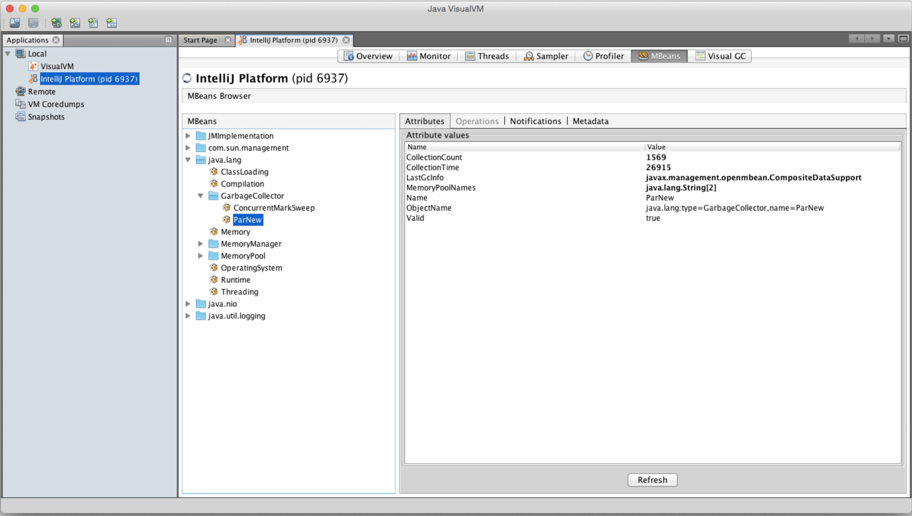
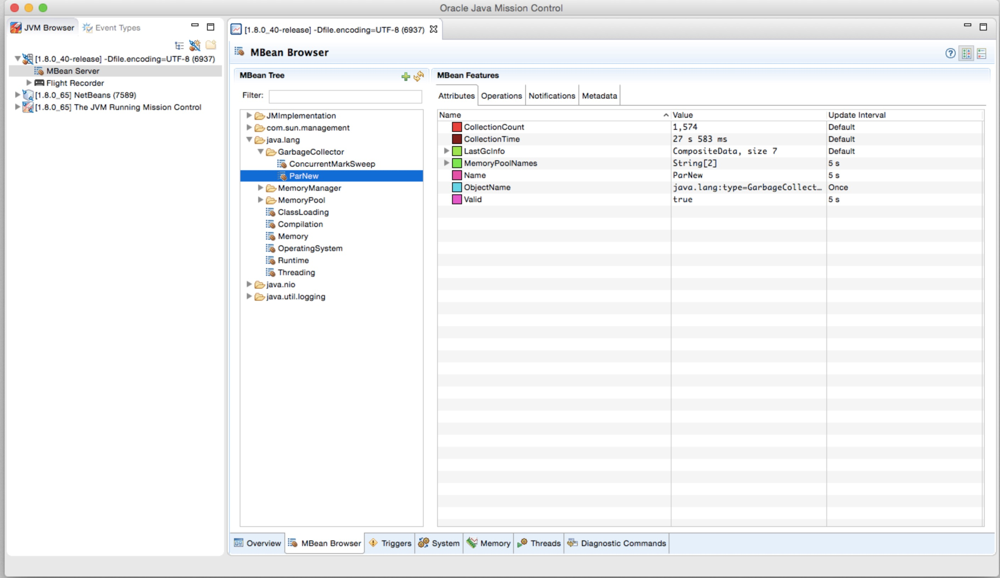

正如截图所示,有2个GC收集器. 一个负责年轻代,一个负责老年代. 元素的名字对应着收集器的名字. 从截图中,我们可以看到这个JVM年轻代用的是ParallelNew 收集器, 老年代用的是CMS.

对于每个收集器,JMX API会暴露如下信息:
- CollectionCount - 当前收集器收集的次数
- CollectionTime - 当前收集器累计运行时间. 这是所有GC事件的累计wall time. (可以参考文末参考)
- LastGcInfo - 上次垃圾回收的详细信息. 详细信息包括事件的持续时间,开始时间以及不同内存池收集前后的使用量
- MemoryPoolNames - 这个垃圾收集器管理的内存池的名称
- Name - 垃圾收集器的名字
- ObjectName - 当前MBean名称, 与JMX规定对应
- Valid - 当前JVM是否可用该收集器. 个人从未看到除了true以外的别的值.

个人经验, 这个信息并不足以判断GC效率. 它的唯一用途就是你希望自己获取关于GC事件的通知. 这种场景非常少, 你会在后面看到我们还有更好的方式来观测GC活动.

## **JVisualVM**
[JVisualVM](https://docs.oracle.com/javase/7/docs/technotes/tools/share/jvisualvm.html)在一般的JMX client基础上添加一个而外的插件[VisualGC](http://www.oracle.com/technetwork/java/visualgc-136680.html), 并通过它提供了一个GC事件的实时视图和JVM不同内存区域的实时占用.

VisualGC 插件最常见的场景就是监控本地运行的应用. 当一个应用开发者或者性能专家想通过一种简单的方式来获取应用测试期间GC性能的直观信息的时候,一般也会使用VisualGC.
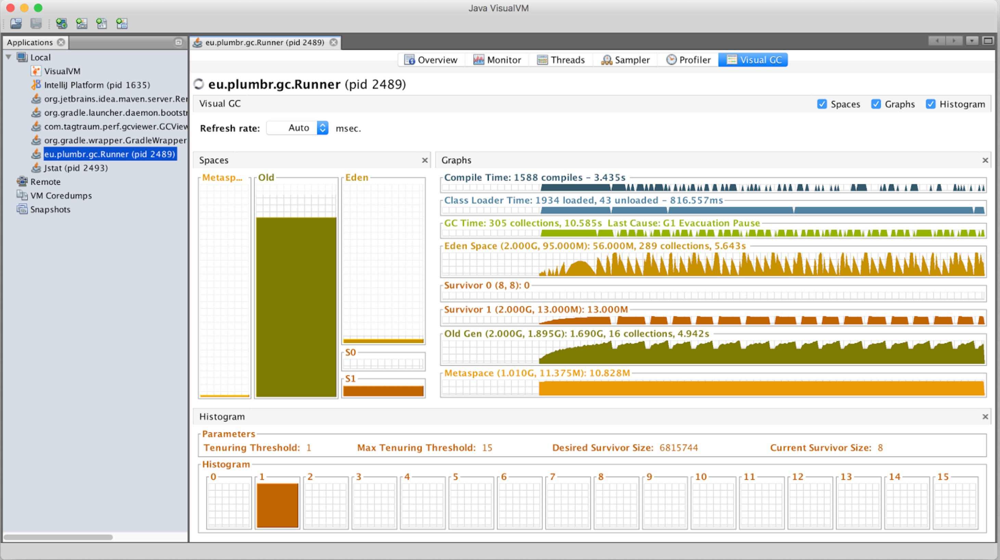
在图的左边,你可以看见不同内存池的占用:Metaspace/持久代, 老年代, Eden区和2个Survivor区.
在图的右边,前两个图展示了JIT编译时间和class加载时间.紧接着的6个图展示了不同内存池使用空间的历史数据,么个内存池的GC收集次数和GC的累加时间. 每个内存池的当前大小,峰值使用和最大大小都显示出来了.

最下边是年轻代当前对象年龄的分布情况. 关于对象晋升的监控脱离了本章的内容,这里就不展开了.

与纯JMX工具相比, JVisualVM上的VisualGC 插件提供了对JVM更好的监控视图, 所以当你只有2个工具的时候, 你应该优先选择后者. 如果你可以使用其他除本章的工具之外的工具, 请继续读下去. 别的选择可能给你更多的信息和更好的展示, 但是JVisualVM更适合于这种特殊场景下性能优化--对象分配优化.


## **jstat**
[jstat](https://docs.oracle.com/javase/8/docs/technotes/tools/unix/jstat.html) 也是标准JDK分发中的一个部分(Java VM statistics monitoring). 这个命令行工具可以用来获取当前运行JVM的指标. JVM可以是本地也可以是远端的.jstat支持的所有指标可以通过运行*jstat -options* 来获得. 下面是最常用的选项:

| 选项 | 显示信息 |
| ----------------- | ------------------------------------------------------ |
| class | 显示类加载统计  |
| compiler | 显示JIT编译器统计 |
| gc | GC统计 |
| gccapacity | 分代空间容量统计 |
| gccause | 与gcutil类似,GC信息summary信息和最近的一次和当前(如果有)GC时间的触发原因 |
| gcnew | 年轻代统计 |
| gcnewcapacity | 年轻代大小和对应空间的统计 |
| gcold | 老年代和持久代统计 |
| gcoldcapacity | 老年代大小统计 |
| gcpermcapacity | 持久代大小统计 |
| gcutil | gc summary信息 |
| printcompilation | gc summary信息 |

这个工具在你想要快速获取一个当前JVM健康状况和GC收集情况时特别有用. 可以通过运行*jstat -gc -t PID 1s*(PID是你想要监控的进程ID, 可以通过*jps*命令获取当前运行的java进程列表). 这个命令会每秒钟打印一次GC信息:

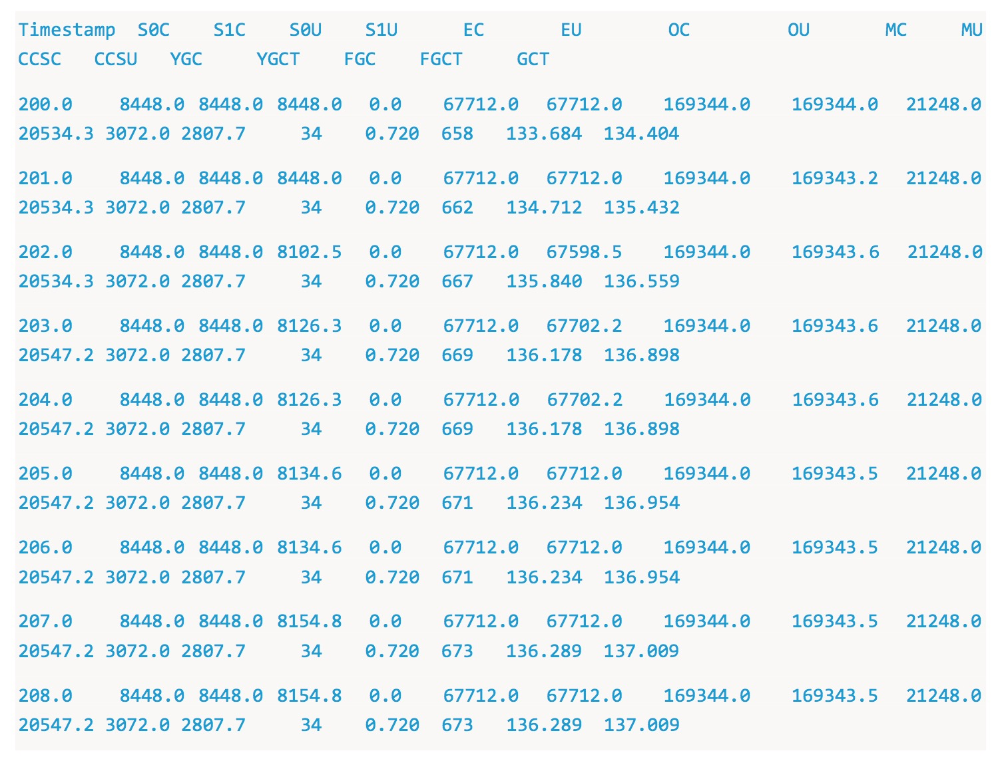

可以从jstat的[帮助文档](http://www.manpagez.com/man/1/jstat/)来获取上述选项的含义.从我们现在已经掌握的知识可以知道:
- jstat从JVM启动后200秒开始连接. 可以从第1列Timestamp看出来.然后就会因为我们设置的*1s*而每秒钟收集打印JVM的信息.
- 从第一行可以看出,年轻代已经收集了34次(YGC列), 整个堆已经收集了658次(FGC列).
- 年轻代垃圾收集器已经总共运行了0.720秒(YGCT列).
- 总的Full GC时间是133.684秒(FGCT列). 这个很关键, JVM总共运行了200秒, **66%的时间被用在FullGC上**.

当我们接着看下一行的时候, 问题就更加清楚了:
- 从上次打印开始, 在1秒钟内已经执行了超过4次的FullGC(FGC列)
- 这4次FullGC已经占用了1秒中的大多数时间.与第一行相比,FullGC运行了928ms或者**92.8%的时间** 
- 与此同时,从OC和OU列可以看出,当4次收集完成后, 老年代**总空间OC**169344.0KB依然有169344.2KB**被占用** *译注,这里数据有问题, OC应该大于OU*. 在928ms内清理了800bytes是不正常的.

只看了jstat输出的前2行,我们知道这个应用目前的状况非常糟糕.分析后面的几行后,我们确认了这个问题还在持续发生.

JVM几乎已经停滞了, 因为GC消耗了90%的计算资源. 就算是在进行完所有的清理工作后, 老年代依然还有很高的占用. 后面的分析会确定这个事实. 因为这个应用在一分钟后发生[java.lang.OutOfMemoryError: GC overhead limit exceeded](https://plumbr.io/outofmemoryerror/gc-overhead-limit-exceeded)而刮掉了.

从上面的例子可以看出, jstat可以快速反映出JVM的健康状况,尤其是在GC异常的时候. 作为一般的指导原则, 可以根据下面的现象来快速分析jstat的输出:
- 最后一列GCT的变化与总时间Timestamp的变化, 可以看出当前是否有超负荷GC发生. 如果你看到每一秒钟,与总时间相比,GCT增加了很多,那么有超负荷GC发生. GC开销是否过多取决于你的应用, 而且应该根据需要满足的性能要求得出. 但是一个基本要求是,该值不应该超过10%.
- YGC列和FGC列的快速改变表明了young gc和Full gc可能太过频繁. 如此多的STW事件也会给应用的吞吐量造成影响.
- 当你看到当FGC列增加了,但是你却没有看到老年代的OU列与OC列基本相等,OU也没有下降,那么这可能是GC性能很差的征兆.

## **GC 日志**
GC相关信息的下一个来源就是GC日志了. 因为内嵌在JVM中, 所以GC日志(大多数情况下)可以给你关于GC活动最有用和复杂的概览视图.GC日志是最标准的,应该被当做GC衡量和优化的终极可信源头.
GC日志是明文的,可以打印到标准输出流或者重定向到一个文件. 有很多关于GC日志的JVM选项. 比如,你想看到在每次GC事件期间, 应用线程被暂停的时间,你可以使用(*-XX:+PrintGCApplicationStoppedTime*)又或者你想看到不同类型应用被GC的信息,你可以使用(*-XX:+PrintReferenceGC*).

每个JVM最少的应该被记录的信息可以通过下面的启动脚本实现:

```
-XX:+PrintGCTimeStamps -XX:+PrintGCDateStamps -XX:+PrintGCDetails -Xloggc:<filename>
```

这个会让JVM打印每个GC时间的时间戳以及信息到文件中. 具体的信息与采用具体的GC算法相关. 当使用Parallel GC时,输出应该像下面这样:
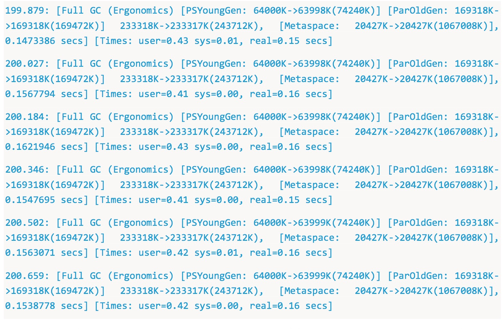

不同的格式我们在 [GC算法实现](#GC 算法:实现) 中讲过, 所以如果你不熟悉的话,你应该先看下这个章节. 如果你已经可以翻译上面的输出, 那么你可以发现:
- 这个日志在JVM启动200秒后提取
- 在日志的780ms中, JVM暂停了5次(第六次因为才开始,还没有结束,所以没计入在内). 所有的这些暂停都是FullGC暂停.
- 总的暂停时间是777ms,或者99.6%的运行时间
- 与此同时,可以看到老年代的容量和占用. 当GC尝试过几次释放空间后,几乎全部的老年代(169472KB)都还在使用(169318K).

从输出可以看出, 就GC而言, 该应用运行的并不算好. 应用基本暂停了因为GC占用了99%左右的计算资源. 得到的结果就是, 清理过后, 老年代基本全部占满. 这个示例应用,与前面*jstat*章节的应用一样,会在几分钟后因为[java.lang.OutOfMemoryError: GC overhead limit exceeded ](https://plumbr.eu/outofmemoryerror/gc-overhead-limit-exceeded)错误停止运行. 并且以此判断该问题十分严重.

从上面的例子,我们可以看到, GC日志在关于JVM健康度中关键表征尤其是在垃圾收集器是否正常方面. 作为一般的指导原则,下面的症状可以通过GC日志快速识别:
- 太多的GC负担. 当整个GC暂停非常长, 应用的吞吐量急剧下降. 该阈值是应用相关的. 一般的指导原则是, 超过10%的GC收集时间就很可疑了
- 非常长的单个暂停. 不管何时, 当某个暂停非常长, 停用的时延便开始增加. 比如说, 当延时性要求应用的某个事务必须在1s内完成, 那么你无法忍受任何的GC暂停超过1s.
- 老年代占用超过阈值. 不管何时, 老年代在经过几次FullGC后, 依然保持了很高的占用(快要满了), 那么你会面临一个GC瓶颈. 不管是因为外部资源不足还是内存泄漏. 这种现象一般会触发GC过载.

如你所见, GC日志提供了当前JVM 内部运行GC相关的非常详细的日志. 然而, 对于大多数的复杂应用, GC日志包含在各种数据之中, 而且很难被我们读取和分析.

## **GC Viewer**
为了处理如此多的GC日志, 一个办法就是写自己的GC日志解析器来得到可视化信息.在大多数啊情况下, 因为不同GC算法产生的信息不同, 不太适合来自己实现这样的解析器. 取而代之的是, 我们可以采用一个已经存在的软件: [GCViewer](https://github.com/chewiebug/GCViewer).
GCViewer 是一个用于解析和分析GC日志的开源软件. 对应的GitHub 页面提供了详细的可用metric列表. 下面我们会看到这个最常用的GC分析工具.

第一步就是取得有用的GC日志文件. 这应该与你在性能优化阶段的使用场景一致. 比如你的IT部门在每周五下午抱怨应用运行的很慢, 然后你想知道这个是不是GC导致的, 那么你就没必要分析星期一早上的GC日志.
当你拿到GC日志后, 你可以通过GCViewer打开,然后看到如下类似的界面:
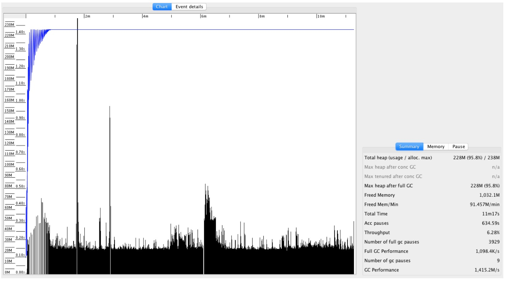
图标区域被用来可视化GC事件. 可用信息包括所有内存池的大小和GC事件. 在上图中, 只显示了2个指标:总共用的堆(蓝色)和各个GC暂停时间(底部的黑色柱状图).

从图中我们可以看出一个很有趣的现象: 内存在用的快速增长. 在大约一分钟, 整个堆的占用达到了最大可用堆内存. 这可能是个问题 - 堆的大多数空间都被占用,这样新的对象分配无法进行, 进而导致频繁的FullGC. 这个应用要么是内存泄漏, 要么是限制的内存不合理.
另一个可能的问题就是, GC暂停的频率和持续时间. 我们可以看到,在初始的30s, GC几乎一直在运行, 而且最长的暂停达到了1.4s.

右边的小面板包括了3个Tab. 在 Summary Tab, 最有趣的数字是 吞吐量和GC暂停次数(和FullGC暂停次数). 吞吐量展示了应用运行时间所占比例, 相反的就是GC占用的时间.
在我们的示例中, 吞吐量是6.28%. 也就是说**93.72%的时间用于GC**. 很明显这个应用有问题-它本应花费大多数的CPU时间来执行真正的工作,当实际上是,都被用来清理垃圾.

下一个又去的Tab是Pause:
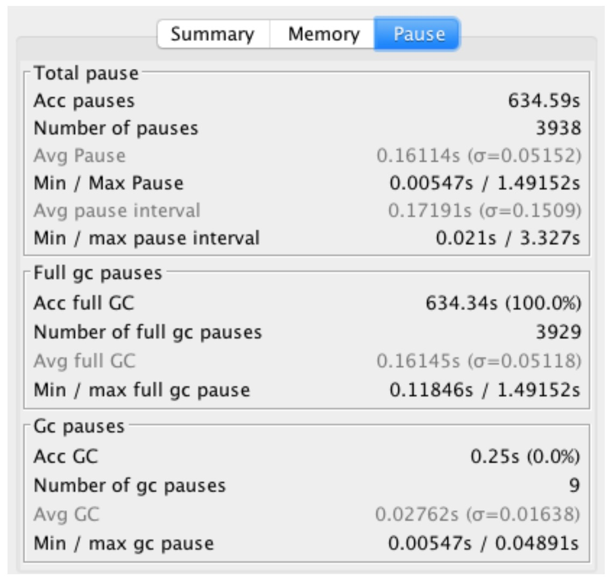
Pause 页展示了总的, 平均, 最大, 最小的GC暂停, minor暂停和major以及总暂停都分开展示. 当优化应用的低延时时, 这个给了我们一个关于当前应用是否有长暂停的直观印象. 从图中,我们可以看出**累计暂停时间634.59s**以及**总共暂停3938次**, 这对于一个只运行11分钟左右的应用来说太长了.
关于GC事件更加详细的信息可以从主界面的Event details得出:
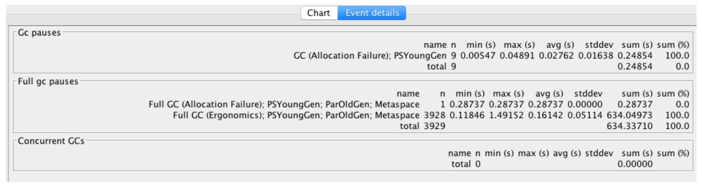
从这里你可以看到日志中记录的所有重要信息的一个概览:minor和major暂停, 以及并发-非STW GC事件. 在我们的例子中, 可以明显看出, FullGC导致了大多数的吞吐量和延迟, 从数据上看就是, 有**3928次FullGC暂停用了634s完成**.


## **Profilers**
这里我们将介绍一系列的[优化](https://zeroturnaround.com/rebellabs/developer-productivity-report-2015-java-performance-survey-results/3/)工具.
正如前面章节介绍的工具一样,GC相关优化只是这些优化工具的一部分功能.
这里我们只关注GC相关的优化.<br>

首先我们需要注意到的是 - 优化公主有时或者趋向于被错误的使用,尤其是在有更好的替代方案的时候.
有时候优化很有用,比如当我们检查到应用的CPU有热点的时候. 而其他场景下我们都有更好的选择.
<br>

这也适用于GC优化. 当我们遇到应用因为GC带来的高延迟或者低吞吐量时, 你并不是真的需要一个优化器,
前面介绍的工具(jstat,visulized gc 日志)就够了. 因为他们更快. 尤其是在收集产品线上的数据时,
优化器不能因此而引入更多的性能开销.
<br>
但无论什么时候,你确定你必须要优化GC对应用的影响时,优化器都在收集对象创建信息方面起到了很重要的作用.
想想前面-GC 暂停时因为有对象没法在指定的内存池上分配触发的. 而这只在你创建对象时发生.
所有的*优化器可以*通过分配优化来跟踪对象的创建. *通过对象创建的跟踪,这告诉了我们关于内存真正创建的对象*.
<br>

通过优化器, 我们可以知道应用创建对象的主要位置.相比GC优化, 优化器器还会暴露最耗费内存的对象以及线程.
<br>

下面我们会介绍3种不同的优化器:hrpof,JVisualVM和AProf.
### **hprof**
hprof绑定在[jdk](https://docs.oracle.com/javase/8/docs/technotes/samples/hprof.html)内部.因为它存在于所有环境中,这个是我们优先考虑的优化器.<br>

为了使用hprof, 采用如下的命令行激活:

```
java -agentlib:hprof=heap=sites com.yourcompany.YourApplication
```

在应用退出后, 会在工作目录生成一个文件java.hprof.txt.用文本编辑器打开,你可以搜索
"SITES BEGIN"就会给你如下的一些信息:
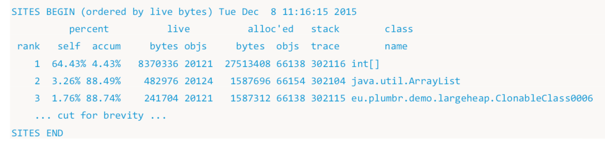
从上面可以看出每次分配时创建的对象个数. 第一行表示有64.43%的对象是int数组在编号为302116的地方创建, 然后搜索:"TRACE 302116":
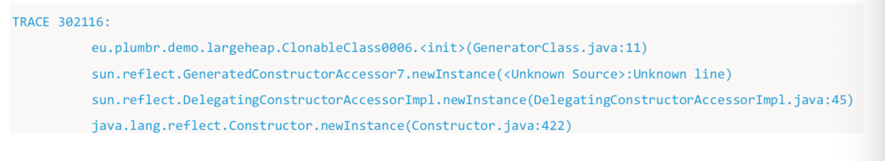
所以我们知道了64.43%的对象(int 数组)是在ClonableClass0006的构造函数中创建的.这样你就可以进一步优化代码了.
译注: 测试代码可以使用[BigHeapTest](src/memory/BigHeapTest.java) 测试文件在[java.heap.txt](res/gcbook/java.hprof.txt)

### **Java VisualVM**
这是JVisualVM第二次出场. 在前面我们介绍了可以用它来监控JVM GC活动. 在这个章节我们会展示他在对象创建监控方面的能力.
<br>
将JVisualVM连接到你的JVM后:
1. 打开Profiler 页, 确保 Settings里面的 Record allocation stack traces是打开的.
2. 点击Memory按钮 开始内存采集.
3. 等应用运行一段时间来确保工具可以收集到足够多的数据.
4. 点击Snapshot按钮, 这里会展示收集到信息的快照.
译注图(应用可能不一样):
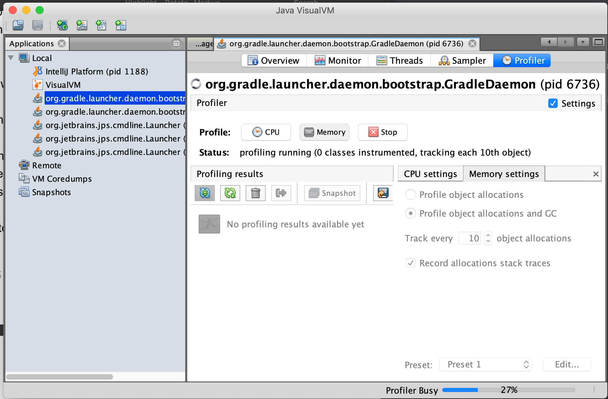

在完成上面的步骤后, 你可以看到如下的信息:

从上面可以看到每个类创建的对象,在第一行我们看到大多数的对象是int[]数组. 
右键点击可以看对应的堆栈信息:
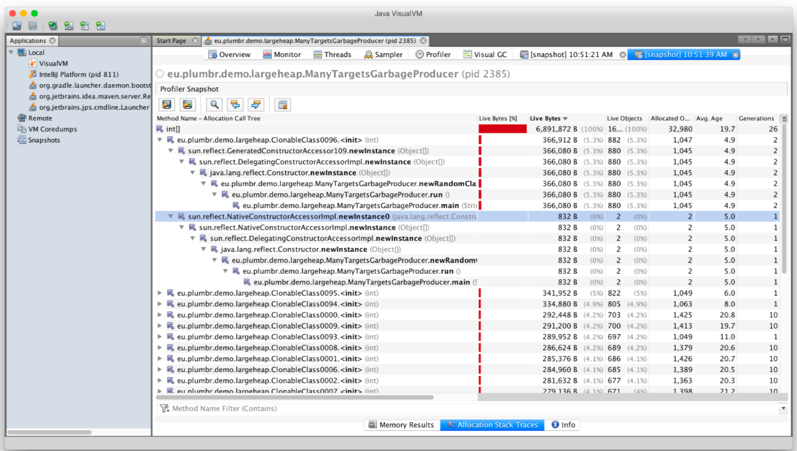
与hprof相比, JVisualVM让处理信息更加方便--从上面可以看到所有分配int[]数组的堆栈信息, 这个可以让我们不用不停的重复匹配stacktrace.

### **AProf**
最后一个(不是全部)的是[AProf](https://code.devexperts.com/display/AProf/About+Aprof)
译注, 这个使用跟HProf差不多. 请参考官网.

# GC 优化: 实践
这一节我们会覆盖常见的几种与GC相关的性能问题.问题的示例都是那源于真实的应用, 只是为了方便做了简化.

## 高的分配率
分配率(Allocation Rate)用于描述单位时间内的内存分配数量.一般情况下,单位是MB/sec.
如果愿意你也可以使用PB/year. 所以这个没有什么魔法,只是用于衡量java代码在一段时间内分配内存的数量.

<br>
一个很高的分配率对应用来说是个麻烦. 当在JVM上运行时,这个问题会导致很大的GC负担.

### 如何衡量分配率
一种方法是打开GC日志(-XX:+PrintGCDetails - XX:+PrintGCTimeStamps flags). JVM开始启动后会记录如下的类似信息:

从上面的GC日志,**我们可以计算出分配率--年轻代在完成GC后可开始下次GC前的大小**
以上面的为例我们可以得出:
1. JVM 启动*291ms*后,有*33280K*对象创建,第一次minor GC清理年轻代后,有*5088K*的对象剩余
2. JVM 启动*446ms*后,年轻代涨到了*38368K*并且触发了下一次GC, 清理后, 剩余*5120K*
3. JVM 启动*829ms*后,年轻代是*71680K*,GC后是*5120K*

那么我们可以得到如下的表格(根据其中的差值):
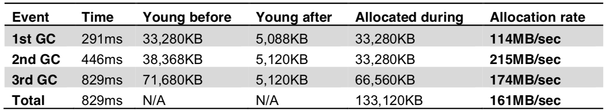
现在我们知道了当前软件分配率是*161MB/sec*

### 为什么我需要关心
在我们得到分配率后,我们知道怎么了降低分配率来提高吞吐量或者降低GC延迟. 
首要的是, 你应该注意到只有*minor gc*分配的年轻代受影响. 老年代的GC频率和GC暂停都不会受到分配率的影响.
但是,相反的它受到*promotion rate*影响(后面会讲到).
<br>

当我们知道我们只需要focus在minor gc的暂停后, 我们需要看看年轻代的内存池.
因为内存分配发生在[Eden](#eden), 我们可以很快的看看Eden区的大小如何影响分配率. 我们可以假设
增加Eden区的大小来减少minor gc的频率以此来满足更快的分配率.

<br>
事实上, 我们可以通过-XX:NewSize -XX:MaxNewSize -XX:SurvivorRatio这些参数来实现2倍的分配率差别:
1. 在一个100M的Eden区上,降低分配率到100MB/sec
2. 增大Eden区到1GB,增大分配率不到200MB/sec

如果你怀疑这是怎么办到的--*如果用更少的GC暂停/更低的频率停掉应用线程,那么你可以做更多的事情,更多的事情一般也会创建更多的对象,所以有更高的分配率*
<br>
现在在我们下结论("Eden越大越好")之前, 你应该意识到分配率可能和你应用的实际吞吐量正相关.
这个与吞吐量的测量有关. 分配率会直接影响你的应用线程因为minor gc暂停的频率.
但是整体上来看, 还要考虑major gc暂停和应用相关的吞吐量指标而不是MB/sec.
<br>

### 举个例子
比如这个[例子](src/memory/Boxing.java). 假设它与另外一个传感器一起工作来提供一个数字.
这个应用持续的在一个专用线程中更新一个随机值.然后其他线程能看到最近更新的值并在*processSensorValue*方法中做些有意义的事情.
```
public class BoxingFailure {
private static volatile Double sensorValue;
  private static void readSensor() {
    while(true) sensorValue = Math.random();
  }
  private static void processSensorValue(Double value) { 
    if(value != null) {
        //...
    } 
  }
}

```
正如这个类名所暗示的, 这里的问题是自动封箱. 为了可以做空指针检查,作者将变量sensorValue使用了大写D-double对象.
这个例子是一个很常见的在获取值很费操作时,基于最近的值做处理的例子. 在真实世界中,一般会比获取一个随机值更费操作.
因此,一个线程持续生成新的值,另一个计算线程使用它们来避免费时的获取操作.
<br>

这个示例应用因为过高的分配率导致GC没法释放足够的空间而受到影响. 下面会讲到怎么验证和解决这个问题.

### 我的JVM会被影响吗?
首先,你应该只在你的吞吐量下降时才开始担心. 由于应用开始创建很多对象而且很快被丢弃了,所以minor gc频率激增. 
在有足够的负载时,这会让GC严重影响吞吐量.
<br>
当你遇到这样的情形,你可能会遇到如下的相似的GC日志(以**-XX:+PrintGCDetails -XX:+PrintGCTimeStamps -Xmx32m** 运行[示例](src/memory/Boxing.java)):


你应该最先注意到的是**GC事件的频率**. 这意味着有很多很多的对象被创建. 而且,**GC后的年轻代变得很低,而且没有FullGC发生**.
这些现象都意味着GC对当前应用的吞吐量有很大影响.

### 怎么解决?
在某些情况下, 增加年轻代可以很容易的降低高分配率的影响. 这并没有降低分配率,而是降低了GC频率. 这样的可以生效的原因是每次只有少量的对象存活. 因为minor gc暂停的时间主要
取决于**存活**对象的多少,所以GC暂停时间不会因为堆变大而显著增加.

这个结果是显而易见的,以参数-Xmx64m运行[示例](src/memory/Boxing.java):
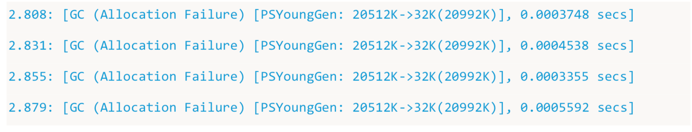

然而就算这样, 给更多的内存显然不是一个可靠的解决方案.在有了前面内存优化器后,我们可以很容易的发现大多数垃圾在哪里产生.
特殊的, 99%的是**Double**在**readSensor**方法创建.一个简单的优化就是将Double替换为原始类型,而且null可以替换为**Double.NaN**.
因为原始类型并不是对象,所以不会有垃圾产生,也就没有什么可回收的了.一个存在对象的某个属性被直接覆盖而不是创建一个新的对象.

译注:优化前的[hprof](res/gcbook/java.hprof-boxing.txt)
```
SITES BEGIN (ordered by live bytes) Wed Mar  6 17:46:11 2019
          percent          live          alloc'ed  stack class
 rank   self  accum     bytes objs     bytes  objs trace name
    1 89.70% 89.70%   7797576 324899  19162752 798448 302173 java.lang.Double
    2  0.84% 90.54%     73008   38     73008    38 300271 byte[]
    
TRACE 302173:
	java.lang.Number.<init>(Number.java:55)
	java.lang.Double.<init>(Double.java:592)
	java.lang.Double.valueOf(Double.java:519)
	memory.Boxing.readSensor(Boxing.java:12)
	
```

在[简单的改动](src/memory/FixedBoxing.java)后,应用已经移除了大多数的GC暂停.在某些情况下,JVM会足够聪明的通过逃逸分析技术来决定是否移除
大量的内存分配.简单来说,JIT编译器可以证明最近创建的某个对象从来不会逃出它创建的范围. 在这种情况下,实际上不需要再堆上创建它进而产生垃圾.
所以JIT编译器直接:消除这次分配.可以查看这个[例子](https://github.com/gvsmirnov/java-perv/blob/master/labs-8/src/main/java/ru/gvsmirnov/perv/labs/jit/EscapeAnalysis.java)

## 提前提升
在解释提前提升之前,我们需要熟悉它的基础概念--提升率. 提升率作为衡量单位时间内
从年轻代传播到老年代的对象. 与分配率类似,一般以MB/sec作为单位.
<br>
JVM预期的行为是提升长时间存活的对象从年轻代到老年代. 回忆下我们前面说到的分代假设,
我们可以构建一个场景-不止长时间存活的对象被安置在老年代. 在这个场景下,这些本来只会短时间存在的对象被提升到了老年代,这就是
**提前提升**.

### 如何测量提升率
测量提升率的一种方式就是打开GC日志:*-XX:+PrintGCDetails -XX:+PrintGCTimeStamps*.
这样的话,JVM就会记录如下的片段:

从上面我们可以看到年轻代和整个堆在GC前和GC后的大小.知道了年轻代和整个堆的占用后,
可以很容易计算老年代的大小.GC日志表达的信息如下:

译者注: 
```
$$ ((youngbefore-youngafter) - (totalbefore-totalafter))/time $$
```
这样我们便可以提取出对应的时间段的提升率.
我们可以看到平均的提升率是92MB/sec, 最大值是140.95MB/sec.
<br>

注意到我们只能从minor gc中提取信息. Full GC没有暴露提升率因为GC日志中暴露的老年代使用率改变也包括major gc清理掉的对象.

### 为什么我需要关心?
与分配率类似,提升率的主要影响就是GC暂停的频率.不同的是分配率影响的是*minor gc*的频率,
而提升率则影响了*major gc*的频率. 让我解释一下--你提升到老年代的东西越多,你就更快的把它填满.
把老年代越快的填满,那么用来清理老年代的GC就越多.

正如我们前面章节看到的,FULL GC显然需要更多的时间，因为他需要与更多的对象交付并且
执行而外的复杂的活动比如去碎片。
<br>

### 举个例子
让我们看下另外一个有提前提升的[示例](src/memory/PrematurePromotion.java).
在这个例子中,应用会获取一批对象data,然后累积,当一定量的对象达到后,进行批处理:
```
public class PrematurePromotion {
    private static final Collection<byte[]> accumulatedChunks = new ArrayList<>();
    private static void onNewChunk(byte[] bytes) {
        accumulatedChunks.add(bytes);
        if(accumulatedChunks.size() > MAX_CHUNKS) {
        processBatch(accumulatedChunks);
        accumulatedChunks.clear();
    }
 }
}
```
这个应用会有提前提升的问题. 后面我们会讲到怎么验证和解决.

### 我的JVM会受影响吗?
一般来说,提前提升会有如下形式的现象:
1. 应用运行一小段时间就有很多次FullGC.
2. 老年代在每次Full GC后占用很低, 一般低于10-20%的老年代总大小.
3. 提升率接近于分配率.

通过我们的示例应用来展示这个问题有点技巧,我们会小小作弊一下-让对象提升到老年代稍稍早于它默认时间.
通过如下的启动参数,我们会看到如下的GC日志：
```
-XX:+PrintGCDetails -XX:+PrintGCTimeStamps -Xmx24m -XX:NewSize=16m -XX:MaxTenuringThreshold=1
```


第一眼看去，好像过早提升并没有出现。但是事实上,老年代的占用在每次GC后都在减少. 然而如果没有更少或者没有对象被提升,我们就不会
看到大量的Full GC事件.
<br>
有一个很简单的解释来解释这种现象:当有很多对象被提升到老年代,有些已有的对象会被回收.
这就方式了老年代的使用率在下降，但是事实上有很多对象被持续的提升，进而导致FullGC。

### 解决办法
为了解决这个问题，我们需要保证年轻代可以容纳这些缓存对象。有两个办法可以做到。
第一个是增大年轻代：-Xmx64m -XX:NewSize=32m. 这样启动饮用后我们看到Full GC次数少了很多，
同时几乎不影响minor gc的时间：


另一个办法就是降低批处理的大小，这也会给我们一个类似的结果。
选择哪一个解决办法取决于应用真实情况是啥. 大多数情况下,业务逻辑不允许降低批处理大小.在这种情况下,
增加更多的内存或者重新分配内存大小是可能的解决办法.
<br>
如果都不行的话, 也许我们可以优化数据结构来占用更小的内存. 但是最终目的都是一样:
让瞬时数据尽可能放在年轻代.

## 弱引用 软引用和幻影引用
另一类可能影响到GC的就是应用中的非强引用.这个可能会在某些场景下帮助避免[OutOfMemoryError](https://plumbr.eu/outofmemory),但是大量使用这些引用
可能会加大GC对应用程序性能的影响.

### 我为什么要关心?
当使用**弱引用Weak reference**时,我们需要意识到,这些引用是可GC的。 每当CG发现某个对象是弱引用可达时，
也就是说这个最后一个引用这个对象的是一个弱引用时，这个对象会被放到对应的**ReferenceQueue**中，然后
变成可以适合做Finalization。可能会有人从这个ReferenceQueue中poll对象然后执行一些相关的清理活动。
这个常见的例子就是移除cache中已经不在的key。

<br>
这里的技巧是你依然可以创建那个对象的强引用,也就是说,在执行finalize和回收之前,GC必须再次检查是否可以
真的进行回收.也就是说,被弱引用引用的对象并不会在下个GC 周期回收.

<br>
弱引用实际上可能比你想的多的多. 许多缓存的方案都使用的弱引用. 所以即使你没有直接声明,可能在你的应用中也大概率有很多弱引用对象.

<br>
当使用**软引用Softreference**时,你只需要记住,软引用比弱引用更少被清理. 准确的说,这个取决于JVM的实现.
一般来说,软引用的清理只在最后一次可能发生OOM之前.这也就意味着你可能会经历更长的FULLGC时间或者更平凡的full gc，
因为在老年代中有更多的对象。

<br>
当使用**幻影引用phantom reference**时,你必须自己来做内存管理虽然这些引用会被认为是适合回收的.
这是危险的,因为从javadoc中我们可能会认为这个很容易使用:

```
In order to ensure that a reclaimable object remains so, the referent of a phantom reference may not be retrieved:
The get method of a phantom reference always returns null
为了保证一个对象依然是可以回收的,幻影引用所引用的对象总是返回null
```

令人惊讶的是,很多开发者会跳过下面的一段:<br>
```
 Unlike soft and weak references, phantom references are not
 * automatically cleared by the garbage collector as they are enqueued.  An
 * object that is reachable via phantom references will remain so until all
 * such references are cleared or themselves become unreachable.
```

不像软引用和弱引用,**幻影引用并不会在他们放入队列后被自动回收**.一个对象如果是被幻影引用可达的,这个对象会一直存在直到这个引用被清除或者他们自己变得不可达.

这是对的,为了避免OOM,我们必须在幻影引用上手动调用[clear()](https://docs.oracle.com/javase/7/docs/api/java/lang/ref/Reference.html#clear()).
这样的原因是这是唯一一个方式来找到某个对象变得不可达的方式.与soft或者weak引用不同,你不能
复活一个幻影引用可达的对象.

### 举个例子
以下面的[例子](src/memory/WeakReferences.java)为例,这个代码会创建很多对象,并且在minor gc期间被回收.
与前面的类似为了改变老年代的阈值来改变提升率,我们以如下启动引用:
```
-XX:+PrintGCDetails -XX:+PrintGCTimeStamps -Xmx24m -XX:NewSize=16m -XX:MaxTenuringThreshold=1 
```

可以看到FullGC基本没有，但是让我们使用-Dweak.refs=true 为每个对象创建一个弱引用时,我们可以看到,
很多都不一样了. 有很多原因我们可能会这么做,比如用对象作为一个weakhashmap的key来做对象分配优化.在
任何情况下,使用弱引用可能会导致如下的现象:

你可以看到有很多的FullGC，而且时间越来越长。这是过早提升的另一个场景。但是这次有更少的技巧。 
这个根本原因，当然是弱引用，在添加他们之前，应用创建的对象在被提升之前就死掉了，但是添加之后，他们需要一个
额外的GC周期才会被变得适合GC.像以前一样这可以通过增大年轻代大小来解决-Xmx64m -XX:NewSize=32m:

*译者注:这里因为MaxTenuringThreshold=1,在没有弱引用的时候,那些对象都因为没人引用而被回收了,但是
弱引用会在下一个GC周期才会得到释放所以这些对象都会被放到老年代.*
*译者注：实际测试中，不要弱引用时，基本全是minorgc，使用弱引用时，full gc频率增大，但是minorgc还是很频繁。在增大内存后，与没有弱引用时类似*
 


在使用软引用的[例子](src/memory/SoftReferences.java)中可能更糟.因为软引用可达的对象只会在
应用快要抛出OOM时才会回收. 替换弱引用为软引用,你会看到大量的FullGC事件:


还有最后一个例子关于幻影引用的[例子](src/memory/PhantomReferences.java).
查看源码我们依然后看到一些参数,我们会看到与弱引用类似的GC日志. 事实上, FULLGC的暂停次数会
比弱引用的次数少的多(因为弱应用的finalization复活属性).
*译者注*(有少数的fullgc)

然而在我们添加一个标记-Dno.ref.clearing=true后,我们会很快OOM:


所以,我们在使用幻影引用时必须十分小心,并且我们需要定期的清理幻影引用,如果不这样的话,我们会很快遇到一个OOM.
相信我们,如果在处理referencequeue的线程遇到了没捕获的异常,你的应用会马上死掉.

### 我的JVM是否受影响
一个常见的建议就是考虑打开开关:-XX:+PrintReferenceGC 来查看不同的引用对GC的影响.
如果我们添加这个开关到弱引用的例子中,我们会看到:

同样的, 这个可以用来分析GC是否对应用的吞吐量和延迟的影响.在这种情况下,你最好检查下这些例子.一般情况下,
每个GC周期清理的引用数非常少,大多数情况下是0.如果不是这样,应用可能正用大量的时间来清理引用或者
他们正在被清理,也就需要进一步的调查.

### 怎么解决?
当你证实你的应用正在误用/乱用/过度使用弱引用/软引用或者幻影引用,解决办法就是改变应用的底层逻辑.
这是非常应用相关的,而且没有一般的指导原则.然而我们还是可以给出一些一般的解决办法:
1. 弱引用- 如果这个问题是因为某个内存池的占用增加导致的,对应的内存池可能给出线索.在前面的例子中,增加整个堆和年轻代帮助缓解了这个问题.
2. 幻影引用- 保证你会清理他们.  很容易没有考虑到边界case, 也有可能清理线程没法跟上queue的增加节奏或者停止清理queue.
这样就会给GC带来很大压力并且造成OOM的风险.
3. 软引用- 当软引用被认为是问题根源时,减轻压力的唯一办法就是修改业务底层逻辑.

## 其他的例子
在前面的章节中,我们覆盖了会导致poor gc的最常见的问题. 不幸的是,有很多特殊的case我们没法
应用前面章节的知识. 这一个章节我们会提到一些你可能会遇到的不常见的问题.

### RMI和GC
当你的引用发布或者使用RIM服务,JVM一般会周期性的触发FullGC来保证本地没有使用的对象不会占用对端的空间.
记住,即便你的代码没有精确的发布RMI相关服务，第三方包可能会打开RMI端口。 常见的例子是JMX,当被远程连接时,会
它会使用RMI来发布数据。

<br>
问题可能被周期性的FULLGC暴露出来。 当你检查老年代的占用时，一般不会有啥压力因为老年代一般会有
很多空闲空间。但是当FULLGC被触发时,所有的应用线程被暂停.

<br>
移除远端引用的方法是通过调用System.gc 在远端的class sun.rmi.transport.ObjectTable的e sun.misc.GC.requestLatency()
方法.
<br>

对于很多应用而言,这个没啥必要或者有很明显的副作用. 为了disable这个，里可以在你的JVM启动时设置:
```
java -Dsun.rmi.dgc.server.gcInterval=9223372036854775807L -Dsun.rmi.dgc.client.gcInterva
l=9223372036854775807L com.yourcompany.YourApplication
```
这里设置了System.gc的运行周期为Long.MAX_VALUE. 对于大多数情况,这个永远不会发生.
<br>
另一个办法就是disable掉System.gc()的调用(通过-XX:+DisableExplicitGC).我们并不推荐采用这个办法因为它带来的副作用.

### JVMTI tagging和GC
当你的应用与某个javaagent(-javaagent)一起运行时,有可能通过[JVMTI tagging](https://docs.oracle.com/javase/7/docs/platform/jvmti/jvmti.html#Heap)来给内存中的对象加tag.
Agent可能因为各种原因而添加tag(这超出了我们的范畴),但是有一个GC相关的问题会影响应用的延迟和吞吐量-如果试图给
堆上很大的对象集合打tag的话.

<br>
这里的问题是隐藏在native代码中:JvmtiTagMap::do_weak_oops这个方法会遍历所有
的tags在每次GC事件执行时,而且还会对所有的对象执行一些不那么快速的操作. 更糟的是,这些操作是串行的而不是并行的.

<br>
当有大量的tag时,这意味着GC中的大部分时间都会被一个单线程占用而且得不到任何的并行优化.这可能大量增加GC暂停时间.
<br>
为了检查某个agent时候导致了额外的GC暂停,你可以打开诊断开关:–XX:+TraceJVMTIObjectTagging.
打开这个后,你会大概得到tagmap耗费了多少本地内存和消耗了多少时间来进行遍历.

<br>
如果你不是agent的作者,一般你没法修复这个问题. 除了联系对应的agent供应商外,没有别的可以做了.
这样的话,我们只能建议供应商清理不需要的tag.


### 超大对象

# 参考
## user/sys/real时间
[link](https://blog.gceasy.io/2016/04/06/gc-logging-user-sys-real-which-time-to-use/)
- Real is wall clock time – time from start to finish of the call. This is all elapsed time including time slices used by other processes and time the process spends blocked (for example if it is waiting for I/O to complete).
- User is the amount of CPU time spent in user-mode code (outside the kernel) within the process. This is only actual CPU time used in executing the process. Other processes and time the process spends blocked do not count towards this figure.
- Sys is the amount of CPU time spent in the kernel within the process. This means executing CPU time spent in system calls within the kernel, as opposed to library code, which is still running in user-space. Like ‘user’, this is only CPU time used by the process.
- User+Sys will tell you how much actual CPU time your process used. Note that this is across all CPUs, so if the process has multiple threads, it could potentially exceed the wall clock time reported by Real.

## GC相关演示代码
[link](https://github.com/gvsmirnov/java-perv)