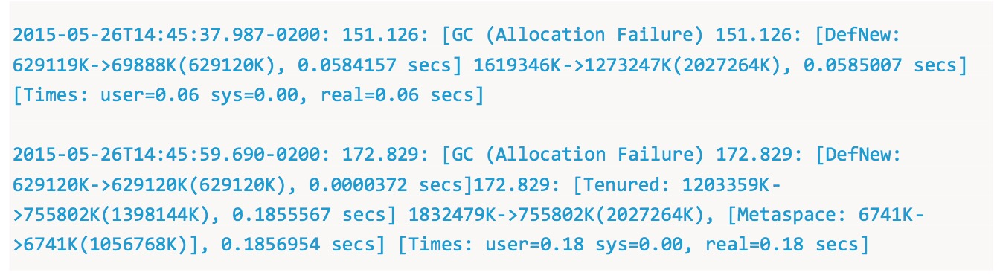

Plumber copyright 中文版本

*该文章被翻译仅做学习之用*

# 目录
### 什么是垃圾回收
### Java中的垃圾回收
### GC 算法: 基础
### GC 算法: 实现
### GC 优化: 基础
### GC 优化: 工具
### GC 优化: 实践

# 什么是垃圾回收(Garbage Collection, GC)
初看之下, 垃圾回收Garbage Collection, GC)应该是用来-找到和清理掉垃圾的. 但是现实中,它却是做的完全相反的工作. GC是用来追踪那些正在被使用的对象, 然后标记其他的对象为垃圾对象. 将这个牢牢记住, 我们马上就仔细看看JVM中被称为自动垃圾回收再利用的过程是如何实现的.

在开始直接讨论细节之前, 我们来看看最最开始的时候, 垃圾回收的本质, 核心概念和途径.

*声明:这本手册主要关注于Oracle Hotspot和OpenJDK的行为,在其他运行时或者JVM中,比如JROCKIT,IBM J9部分行为可能与本手册所说不太一样*

## **手动内存管理**
在我们开始讨论GC的现代化工作方式之前, 让我们来快速看下以前我们是如何手动和精确的控制内存的申请和释放的. 如果你忘记释放内存,你就没法重用该内存. 这片内存也没法被声明为未使用. 这就是**内存泄漏**

下面是一个使用C写的演示手动内存管理的代码:
```c
int send_request() {
size_t n = read_size();
int *elements = malloc(n * sizeof(int));
    if(read_elements(n, elements) < n) {
        // elements not freed!
        return -1;
    }
    // ...
    free(elements)
    return 0;
}
```
正如我们看到的, 很容易就会忘记释放内存. 内存泄漏也变成了一个非常常见的问题. 你只能通过修改代码来解决. 一个更好的方法就是能够自动回收掉不在使用的内存, 消除人为错误的可能性. 这样的自动化方式称为**垃圾回收(Garbage Collection, 简单来说就是GC)**

### **智能指针**
一个最初的方法来自动垃圾回收就是构建一个引用计数. 对于每个对象, 我们可以知道这个对象还被引用了多少次, 当他的引用计数次数变为0了, 这个对象就可以被回收了. 一个熟知的例子就是c++中的智能指针:
```c++
int send_request() {
    size_t n = read_size();
    shared_ptr<vector<int>> elements
              = make_shared<vector<int>>();
    if(read_elements(n, elements) < n) {
        return -1;
    }
    return 0;
}
```
这里的*shared_ptr*就是用来跟踪引用计数的. 这个计数随着你的分发而增加, 当它离开函数Scope时就减少. 当引用计数的值变为0时, *shared_ptr*就自动释放了底层的vector. 无可否认的, 这个例子在真实代码中并不多见, 但是用来演示是足够的.

## **自动内存管理**
在上面的c++代码中, 我们还是必须精确指定说, 我们需要内存管理来帮我们做这些事(*译注:shared_ptr*). 那么我们怎么才能让所有的对象都拥有类似的行为呢? 这么一来就很容易了, 开发者再也不需要关心如何清理他们了. 运行时会自动关注哪些内存不再被使用然后释放它们. 换句话说, 它自动**收集垃圾**. 第一个垃圾回收器是在1959年为Lisp设计的. 现在这门技术已经有了更近一步的发展.

### **引用计数**
在前面c++代码中的共享指针的方式能被用在所有对象上面. 许多语言(Perl, Python, PHP)都是这么做的. 下图更好的展示了这个过程:

绿色的云朵代表了那个仍被程序员使用的对象. 专业点说, 这可能是比如一个正在执行方法中的局部变量, 或者一个静态变量或者其他. 不同的语言可能不同, 我们也并不关注于此.
蓝色的圆圈代表内存中存活的对象, 里面的数字代表了它的应用计数. 灰色圆圈代表了不在被任何正在使用的对象(被绿色云朵引用的对象)引用的对象.

这看起来还不错? 是的. 但是这个方法有个很大的缺陷. 它很容易出现**分离圆圈(detached cycle)**
该范围中的所有对象都因为循环引用而导致引用计数不为0. 如下图:

看到了吗? 上图中,红色对象实际也是垃圾并且应用也不会使用它们. 但是因为引用计数,实际上还是有内存泄漏.

有一些办法可以克服这个问题. 比如使用特殊的'弱'引用或者使用单独的算法来处理循环. 前面提到的语言(Perl, Python, PHP)-都能处理循环引用, 但这个已经超过了本手册的范围. 接下来, 我们将更进一步了解JVM的办法.

### **标记和清扫**
首先, JVM对如何定义一个对象的可达性有更明确的定义. 与前面章节中用模糊的绿色云朵来表示的特殊对象不同, JVM有一个非常明确和清晰的对象集合称为GC Roots:
  - 局部变量
  - 活跃线程
  - 静态域
  - JNI应用

标记和清扫是JVM用来跟踪所有可达(活/live)对象以及保证内存被不可达对象释放后可被从用的常见算法. 它包括以下2步:
  - **标记** 遍历所有从GC Roots能够达到的对象并在本地内存中记录一个这些对象的总账
  - **清扫** 保证所有被不可达对象占用的内存都能够在现在内存分配的时候使用
JVM中不同的GC 算法比如:*Parallel Scavenge, Parallel Mark+Copy , CMS*在实现这些阶段都有细微的不同, 但是从概念上来看都跟上面2步差不多.

这种的办法的一个关键点就是解决了循环导致的内存泄漏:

一个不太好的事情就是, 垃圾回收时,应用线程需要被暂停. 因为你没法统计引用如果它一直在变的话. 这被称为*Stop The world pause (STW)* - 当应用被临时暂停来让JVM有机会可以来做一些内存管理工作(housekeeping). 这可能有各种因素触发, 但是GC是最常见的一个.

在本手册中, 我们会解释GC 在JVM中是如何工作的, 以及如何达到最好的状态来减少STW.
# Java中的GC
前面关于标记和清扫 GC 是一个比较理论化的介绍. 在现实中, 应用了很多调整来适应现实世界中的场景和需求. 一个简单的例子, 来让我们看下JVM需要做怎样的记录来保证我们可以持续的生成对象.
## **碎片和压缩**
无论什么时候,当清扫发生时, JVM必须保证被不可达占用的内存空间可以被重用. 这会(最终)导致内存碎片, 跟磁盘碎片类似, 并导致如下问题:
  - 为了找到合适大小的内存块,写操作变得耗时更长
  - 当创建新对象时, JVM申请连续的内存块. 所以如果有越来越多的碎片,会导致没有一个足够大的内存块可以容纳下新创建的对象, 分配失败的错误就会产生

为了避免这个问题, JVM会保证碎片得到控制. 所以除了标记和清扫外, 在GC的过程也会整理内存碎片, 跟整理磁盘碎片类似. 这个过程重新定位可达对象,让其一个接一个来消除(减少)碎片. 如下图:


## **分代假设**
正如我们前面说到的, 垃圾回收会完全停止应用. 很显然, 对象越多就需要更久的时间. 但如果我们有可能在更小的内存区域上来做GC呢? 在探索各种方式后, 有些学者发现大多数的应用的内存分配都可以分为以下2类:
  - 大多对象很快就没用了
  - 其他的一般都会存活很长的一段时间
这些发现最终导出了弱分代假设. 基于这个假设, VM中的内存被分为2类: **年轻代(Young Generation)**和**老年代(Old Generation/Tenured)**.

当有了这个比较区分和独立的区域划分后, 便有了后来很多GC算法的各种性能优化的方案.

并不是说这样的方法就没有问题. 比如不同代的对象可能会相互应用, 这在GC中被称为实际上的(de facto)GC roots.

但更重要的是, 分代假设可能不适用于有些应用. 因为GC 算法对很快死掉和很可能存活的对象做了优化, 那么在对于中等存活期望的场景下就有比较糟糕的性能.
## **内存池**
如下对堆内存的划分对很多人都比较熟悉了. 很多人不了解的是GC如何对不同的内存池做回收的. 注意到不同的GC算法可能在实现细节上有所不同, 但同样的, 本章里面所讲的都基本一致.


### **Eden**
Eden 区是大多数对象创建时分配的地方. 而且经常有多线程同时创建的情况, 所以Eden区被分为1个或者多个**线程局部分配缓冲(Thread Local Allocation Buffer, TLAB)**. 这些缓冲可以让一个线程直接在自己的TLAB快速分配很多对象并且减少了与其他线程的同步.

当没法在一个TLAB中分配时(大多数情况是因为空间不足), 分配会在一个共享的Eden区域进行.如果这里也没有足够的空间, 就会触发一个在年轻代上的GC过程来释放更多的空间. 如果这次GC也没有在Eden区中生成足够的空来内存, 这个对象就会在老年代上分配.


当Eden区在收集过程中, GC遍历所有的从Roots中可达的对象,并标记它们是存活的.

我们前面提到, 会有些对象有跨代的链接, 所以一个简单的办法就是检查所有从其他代到Eden的引用. 尝试这样做会打破我们最前面的分代假设. JVM 使用了一个很取巧的办法: *card-marking*. 本质上来说, JVM只会粗略标记脏对象(可能有年老代中的对象引用他们)在Eden中的位置. 详细可以参考这篇.

在标记阶段结束后,所有在Eden区中的存活对象都被拷贝到2个Survivor区中的其中一个. 现在整个Eden区被认为是空的并可被用来分配更多对象. 这种方式被称为标记并拷贝:标记所有存活的对象然后拷贝(不是移动)到一个Survivor中.
### **Survivors**
与Eden区相邻的是2个Survivor区分别被称为from和to. 需要认识到其中一个Survivor总是是空的.

空的Survivor区会被用来分配给下次从年轻代存活下来的对象. 所有在年轻代存活下来的对象(包括Eden区和另外一个非空的from区)都被拷贝到Survivor的to区. 当这个步骤完成后, to区就包含对象, 但是from区没有. 然后下一次它们变交换了.


在2个Survivor之间拷贝存活的对象的过程会重复执行多次, 直到有些对象已经成熟并且足够老了. 记住我们基于分代的假设, 那些已经存活一段时间的对象会被期望能够存活更长的时间.

这些成熟的对象会被**提升**到老年代. 当这个发生时, 这些对象不会再从from拷贝到to而是直接到老年代.他们会一直在那儿直到被认为不可达.

实际的成熟阈值可以动态调整, JVM提供参数 *-XX:+MaxTenuringThreshold*来指定上限. 当设置*-XX:+MaxTenuringThreshold=0*,对象会立即提升到老年代而不会拷贝到Survivor区. 默认的值是15. 这也是HotSpot的最大值.

当Survivor的大小不够容纳年轻代所有存活的对象时, 提升会提前发生.
### **老年代**
老年代的实现就更加复杂了. 老年代一般都更大, 而且存放的对象都不太可能被认为是垃圾.

老年代GC的频率比年轻代GC的频率低得多. 而且因为大多数在老年代的对象都预期是存活的, 所以不会发生标记和拷贝. 取而代之的是, 这些对象会被移动来最小化碎片. 清理老年代的算法可能不同. 总的来说, 会经历如下的步骤:
  - 通过设置标记位来标记所有从GC Roots可达的对象
  - 删除所有的不可达对象
  - 通过拷贝(*译注:应该是移动*)所有的存活对象到老年代的头部来压缩老年代的内存空间

从描述可以看出, 老年代的GC必须精确压缩来避免大量的碎片.

### **持久代**
在Java 8 之前, 有个特殊的区域称为持久代. 这里存放了一些元数据(比如类信息). 一些额外的东西比如内在的string(*译注string.intern方法*)也会放在这里. 这也给Java开发造成了很多的困难,因为很难预测这个空间到底要多大. 失败的预测会导致如下的异常:
<p style="color:  #33ccff;font-size: 15px;">java.lang.OutOfMemoryError: Permgen space</p>
与其他的真的内存泄漏-OutOfMemoryError不同, 解决该问题的方案是,增大持久代的大小. 可以通过如下的配置来设置持久代为256MB:
```
java -XX:MaxPermSize=256m com.mycompany.MyApplication
```

### **元空间**
因为要预测元数据的大小实在是太难了而且也不方便, 所以在Java 8 中, 持久代被移除, 取而代之的是使用元空间. 从此开始, 大多数混杂的对象都被从常规Java 堆中移除.

类定义现在也被存入元空间. 它归属于本地(native)内存, 而且不干扰java heap中的常规对象. 默认情况下, 元空间的大小受限于java进程的本地内存可用大小. 这避免了因为程序员添加了一个类导致的 ***java.lang.OutOfMemoryError: Permgen space***. 不限制空间同时意味着风险-让元空间无限制的增长会导致大量的内存换页或者本地内存分配失败.

当你想象限制持久代一样限制元空间的大小, 你可以使用如下的配置:
```
java -XX:MaxMetaspaceSize=256m com.mycompany.MyApplication
```

## **Minor GC, Major GC, Full GC**
清理堆内存中不同区域的GC事件也被称为Minor GC, Major GC, Full GC. 本章中我们会见到不同事件之间的区别. 这些时间的区别也没有很大的相关性.

与GC相关的常见指标就是应用是否满足了SLA(Service Level Agreement) 也就是说是否满足了延迟性或者吞吐量指标. 然后才是GC 事件与结果之间的关联. 更为重要的是, 这些事件是否会停止应用以及停多久.

但是因为Minor, Major和Full GC被广泛使用而且也没有合适的定义, 让我们来更仔细的看下它到底是啥.

### **Minor GC**
在Young区的垃圾回收被称为**Minor GC**. 这个定义很清楚也被广泛接受. 但是还是有很多知识你需要意识到在处理Minor GC事件时:
  1. Minor GC总是在JVM无法为新建对象分配空间时触发. 比如Eden满了. 所以越高的对象分配率意味着更频繁的Minor GC.
  2. 在Minor GC过程中, 老年代被忽略了, 所有从老年代到年轻代的应用都被作为GC Roots. 从年轻代到老年代的应用在标记阶段就被忽略了.
  3. 与常识违背的是, Minor GC也会触发STW暂停, 挂起应用线程. 对于大多数应用而言, 如果大多数对象都被认为是垃圾而且从不拷贝到Survivor/Old区, 暂停的时间是微不足道. 相反的, 如果大多数新生对象都不是垃圾, Minor GC暂停时间就会占用更长的时间.

### **Major GC vs Full GC**
值得注意的是, 无论是JVM规范还是GC得研究论文里面都没有关于这2个的正式定义. 但是第一眼想到的是, 基于我们对Minor GC用于清理年轻代的认识上, 我们不难得出如下定义:
  - **Major GC** 是清理老年代的
  - **Full GC**用来清理整个堆包括年轻代和老年代

不幸的是, 这个可能更加复杂和迷惑. 很多情况下, Major GC是由Minor GC触发的, 想要把它们2个分开是不可能的. 另一方面, 现代的GC算法, 比如G1, 会不停的清理一部分垃圾(所以清理只能是半对的).

从这点我们知道, 我们没必要担心GC是Major 还是 Full GC. 我们更应该关注于这个GC是否会暂停所有的应用线程还是可以和应用线程并发执行.

这个迷惑甚至还体现在JVM的标准工具上. 我们可以通过下面的例子来看下. 我们将比较当某个JVM使用CMS (Concurrent Mark And Sweep) GC时的输出:

让我们先来看下[jstat](https://docs.oracle.com/javase/8/docs/technotes/tools/unix/jstat.html)的输出:

这个片段是从一个JVM启动后的前17s的输出. 根据输出信息, 我们可以知道一共进行了12次Minor GC和2次Full GC用时 50ms. 你可以用GUI工具jconsole或者jvisualvm得出同样的结果.
*译注: YGC: Young GC次数, FGC: Full GC次数, FGCT: Full GC时间, GCT:总GC时间*

在下结论之前, 我们还看下同一个JVM使用另一个工具打印的GC日志(使用*-XX:+PrintGCDetails*我们可以看到一个不同的而且更详细的信息):
```
java -XX:+PrintGCDetails -XX:+UseConcMarkSweepGC eu.plumbr.demo.GarbageProducer
```

基于这个信息我们可以知道, 经过12次Minor GC后, 开始发生一些不同的事情了, 与2次Full GC不同的是, 实际上是一个单次的老年代GC, 并且包含如下阶段:
  - 初始标记阶段(Initial Mark), 耗时:0.0041705s(接近4ms). 该阶段是STW的. 所有的应用线程都被暂停等待初始标记完成.
  - 标记和预清理阶段(Markup and Preclean), 与应用线程并发执行
  - 最终重标记阶段(Final Remark), 耗时:0.0462010s(接近46ms). 该阶段也是STW.
  - 清扫阶段(Sweep). 并发执行而且不会暂停应用线程.

所以我们能从GC日志中看到的, 并不是2次Full GC而是只有1次Major GC来清理老年代.

如果你追求的是延时, 那么从*jstat*的输出就可以让你得出正确的结论. 它正确的列出了两次STW事件耗时总共50ms, 这个会影响当时应用程序的延时. 但如果你尝试优化吞吐量, 你就会被误导了 - *jstat*的输出完全掩盖了并发的工作而只展示了STW 的初始标记和最终重标记阶段.

# GC 算法: 基础
在我们尝试解读GC算法之前, 定义常见的术语和基本原则将更有利于我们理清楚GC实现. 不同的GC算法可能会有不同的实现细节, 但是大多数情况下, 所有的GC算法都关注如下2个领域:
  - 找到所有存活的对象
  - 清除其他所有的东西 -可能死亡的和无用的对象

第一部分, 存活对象的统计都是通过一个叫做**标记Marking**的过程实现的.
## **标记可达对象**
每一个现代的GC都是从找到所有存活的对象开始工作的. 这个概念可以分好的通过下面的图解释(前面讲JVM内存布局的时候说过):

首先, GC定义了一些特殊的对象叫做GC Roots. 可能的GC Roots有:
  - 局部变量和当前执行方法的输入参数
  - 活跃线程
  - 已加载的class的静态域
  - JNI应用

然后, GC开始遍历整个内存来得到一个完整的对象图(object graph). 从GC Roots开始, 然后找到从GC Roots链接的其他对象, 比如实例域. 每个被GC访问到的对象都被**标记**为存活.

活着的对象在上图中被标记为蓝色. 当标记阶段结束时, 所有存活的对象都被标记了. 所有其他的对象(图中的灰色数据结构)都是从GC Roots不可达的对象, 也就暗示了你的应用再也不能使用这些不可达对象了. 这些对象就会被认为是垃圾. GC应该在后面的阶段清除它们.

在标记阶段, 需要注意到以下方面:
  - 应用线程需要被暂停, 因为你没法真正遍历整个图如果它一直在变的话. 当线程被临时暂停, 然后JVM有机会来参与管理(Housekeeping)工作的场景被称为**安全点(Safe Point)**, 同时会导致**Stop The World(STW)**暂停. 安全点可能被各种原因触发, 但是目前为止, GC是最常见的一个. *译注, 还有代码逆优化, 刷新代码缓存, 类从定义(hotswap or instrumentation), 偏向锁撤销, debug操作(比如死锁检测, 堆栈dump)都会触发safepoint* [link](http://blog.ragozin.info/2012/10/safepoints-in-hotspot-jvm.html)
  - 暂停的时间并不取决于整个堆中对象的个数, 也不取决于整个堆的大小, 而是取决于**存活对象**的个数. 所以增大堆的大小并不会直接影响标记阶段的时间.

当**标记**完成狗, GC就可以继续下一步-移除不可达对象

## **移除不可达对象**
不同的GC算法可能会常用不同的方式来移除不可达对象, 可分为以下3种:
  - 清扫 Sweeping
  - 压缩 Compacting
  - 拷贝 Copying

### **清扫**
**标记和清扫Mark and Sweep**算法在概念上选用了最简单的方式来处理垃圾 - 忽略它们.这也就是说, 当标记阶段完成后, 所有被未访问到的对象说占用的空间都被认为是空闲的,可以被用来分配新的对象.

这个方法需要一个所谓的**空闲列表free-list** 来记录每个空闲区间和它的大小. 管理空闲列表给对象分配增加了额外的负担. 这个方式的另一个弱点就是-有很多小的空闲区间,但是没有一个足够大的区间来分配对象. 分配还是会失败(也就是Java中的**OutOfMemoryError**)


### **压缩**
**标记,清扫,压缩Mark-Sweep-Compact**解决了前面和清扫的问题--移动所有标记了的(也就是存活的)对象到内存的最前面. 这样做的缺点就是会增加GC暂停的时间,因为我们需要拷贝所有对象到一个新的地方然后更新这些对象的引用. 这样的好处也是显而易见的-- 通过压缩操作后, 新对象的分配变得非常的简单, 只需要通过指针碰撞(pointer bumping)就可以了. 通过这样的方式, 我们总是可以知道可用空间的大小, 而且也没有了碎片问题.


### **拷贝**
**标记和拷贝Mark and Copy**算法与标记和压缩算法很像, 他们都会重新定位所有的存活对象. 一个重要的不同就是copy会将所有存活的对象拷贝到一个完全新的内存区域.标记和拷贝方法有一个优点就是, 它能够在标记的同时进行拷贝操作. 缺点就是, 他需要更多更大的内存空间来容纳存活的对象.


# GC 算法: 实现
现在我们已经回顾了GC算法背后的核心概念, 接下来我们会介绍特定算法的JVM实现. 一个重要的事情我们必须意识到的是, 对于大多数的JVM而言, 我们都需要2个不同的GC算法--一个用来清理年轻代, 一个用来清理老年代.

你可以从JVM中绑定的一系列算法中选择. 如果你不指定, 那么就会用一个平台相关的算法作为默认. 在这个章节, 每个算法的工作原理都会被讲到.

作为一个快速参考, 下面的列表可以帮你快速参考哪些算法是可以组合在一起的. 注意到这个适用于Java 8, 老的Java版本可能有所不同:

如果上面的看起来很复杂, 不用担心, 现实中, 只会用到4个加粗了的组合. 其他的都被废弃了, 不支持或者在现实生活中使用不太实际. 所以下面的章节会介绍如下4种组合的GC算法实现:
 - Serial GC (适宜用于年轻代和老年代)
 - Parallel GC (适用于年轻代和老年代)
 - Parallel New (年轻代) 和 Concurrent Mark and Sweep (CMS) (老年代)
 - G1 适用于年轻代和老年代被没有分开的情况

## **Serial GC**
这个GC对年轻代使用**标记和拷贝**, 对老年代使用**标记清扫和压缩**. 正如名称所暗示的那样, 这2个收集器都是单线程的收集器, 不能并行执行任务. 这2个收集器都会触发STW, 暂停所有应用线程.

这个GC算法不能发挥现代硬件中多核CPU的优势, 不管CPU有多少个核, 在GC时, 都只会使用一个核.
可以通过下面的脚本来使用该GC算法:
```
java -XX:+UseSerialGC com.mypackages.MyExecutableClass
```
这个选项应该在只有几百M大小的堆内存以及在单核CPU环境下使用. 大多数的服务器环境都不太会是单核CPU. 所以当你在有多核的服务器上使用该选项来启动应用时, 会人为的设置一个可用的系统资源的上限. 这会导致限制的资源并不能用来降低延时或者提高吞吐量.

让我们来看下使用Serial GC时, GC 日志会打印什么有用的信息. 你需用通过如下的参数来打开GC日志:
```
–XX:+PrintGCDetails -XX:+PrintGCDateStamps -XX:+PrintGCTimeStamps
```
输出与下图类似:

这段简短的片段给出很多JVM内部发生的信息. 事实上,上面的片段包括2个GC事件, 一个是清理年轻代, 一个是清理整个堆. 让我们从年轻代的GC开始分析.

### **Minor GC**
下面的片段包括一次在年轻代发生的GC事件的信息:

> 2015-05-26T14:45:37.987-0200<sup>1</sup>: 151.126<sup>2</sup>: [GC <sup>3</sup>(Allocation Failure<sup>4</sup>) 151.126: [DefNew<sup>5</sup>: 629119K->69888K<sup>6</sup>(629120K)<sup>7</sup>, 0.0584157 secs] 1619346K->1273247K<sup>8</sup>(2027264K)<sup>9</sup>, 0.0585007 secs<sup>10</sup>] [Times: user=0.06 sys=0.00, real=0.06 secs]<sup>11</sup>

  1. *2015-05-26T14:45:37.987-0200* GC 开始时间
  2. *151.126* GC开始时距JVM启动多少秒
  3. *GC* 标志是Minor 还是 Full GC. 这一次是Minor GC.
  4. *Allocation Failure* GC触发原因. 这一次是因为无法在年轻代中的任何一区分配对象导致.
  5. *DefNew* GC收集器的名字. 这个神秘的名字代表了单线程的标记和拷贝STW收集器被用来在年轻代收集.
  6. *629119K->69888K* 年轻代回收前和回收后的空间.
  7. *(629120K)* 年轻代总大小
  8. *1619346K->1273247K* 堆的回收前和回收后的空间
  9. *2027264K* 总的可用堆空间
  10. *0.0585007 secs* GC耗时
  11. *[Times: user=0.06 sys=0.00, real=0.06 secs]* GC持续时间, 分为如下3类:
          - user GC线程在GC期间所用的总的CPU时间
          - sys  系统调用和等待系统事件的时间
          - real 应用线程总的停顿时间. 因为Serial GC始终只有一个线程, 所以real time等于user+sys.

从上面的片段, 我们可以精确了解JVM在GC过程中的内存消耗. 收集前, 总共有1619346K空间, 其中年轻代用了 629119K. 从此我们可以知道老年代用了 990227K.

从后面的一系列数字, 我们可以知道, 经过这次收集后, 年轻代降低了559231K, 总的堆空间降低了346099K. 从这里我们可以知道有213132K的对象从年轻代提升到了老年代.

下图给出了GC前和GC后内存使用的快照:


### **Full GC**
当我们理解了第一个Minor GC事件后, 让我们来看下日志中的第二个事件:
> 2015-05-26T14:45:59.690-0200<sup>1</sup>: 172.829<sup>2</sup>: [GC (Allocation Failure) 172.829: [DefNew: 629120K->629120K(629120K), 0.0000372 secs<sup>3</sup>]172.829: [Tenured<sup>4</sup>: 1203359K- >755802K<sup>5</sup>(1398144K)<sup>6</sup>, 0.1855567 secs<sup>7</sup>] 1832479K->755802K<sup>8</sup>(2027264K)<sup>9</sup>, [Metaspace: 6741K- >6741K(1056768K)]<sup>10</sup>, 0.1856954 secs] [Times: user=0.18 sys=0.00, real=0.18 secs]<sup>11</sup>

  1. *2015-05-26T14:45:59.690-0200* GC 开始时间
  2. *172.829* GC开始时距JVM启动多少秒
  3. *[DefNew: 629120K->629120K(629120K), 0.0000372 secs* 与前面类似, 因为分配失败Allocation Failure, 在年轻代发生了一次Minor GC. 对于这次收集, 使用DefNew收集器让年轻代的空间从629120K降到了0. 这里JVM报的事件有点问题(报年轻代还是满的), 这是JVM的bug. 这次回收耗时0.0000372秒
  4. *Tenured* 用于老年代的垃圾回收器名字. Tenured 意味着使用了单线程的STW 标记+清扫+压缩 GC回收器.
  5. *1203359K->755802K* 老年代回收前和回收后的空间.
  6. *(1398144K)* 老年代总空间
  7. *0.1855567 secs* 回收老年代所用时间
  8. *1832479K->755802K* 堆的回收前和回收后的空间
  9. *(2027264K)* 当前JVM堆可用总空间
  10. *[Metaspace: 6741K->6741K(1056768K)]* 元空间的垃圾回收, 可以看见这次没有发现垃圾.
  11. *[Times: user=0.18 sys=0.00, real=0.18 secs]* GC持续时间, 分为如下3类:
          - user GC线程在GC期间所用的总的CPU时间
          - sys  系统调用和等待系统事件的时间
          - real 应用线程总的停顿时间. 因为Serial GC始终只有一个线程, 所以real time等于user+sys.

与Minor GC有明显的区别, 这次GC中, 老年代和元空间也被清理了. 下图给出了GC前和GC后内存使用的快照:


## **Parallel GC**
这个GC对年轻代使用**标记和拷贝**, 对老年代使用**标记清扫和压缩**. 年轻代和老年代GC都会触发STW事件, 停止所有应用线程来执行垃圾回收. 这2个收集器在拷贝/压缩阶段都使用了多线程, 这就是为啥是'Parallel'的原因. 通过这种方式降低了垃圾回收的时间.

GC时的线程数可以通过命令行参数*-XX:ParallelGCThreads=NNN*设置. 默认值是机器的核数.

下面的任何一个JVM启动脚本都会选择Parallel GC:
```
java -XX:+UseParallelGC com.mypackages.MyExecutableClass
java -XX:+UseParallelOldGC com.mypackages.MyExecutableClass
java -XX:+UseParallelGC -XX:+UseParallelOldGC com.mypackages.MyExecutableClass
```
Parallel GC 适用于多核系统, 而且你的主要目标是提交吞吐量. 高的吞吐量是通过对系统资源的有效使用实现的:
  - 收集时, 所有的cpu 核都会用来并行清理垃圾, 这缩短了暂停时间
  - 在GC周期间, 收集器不会消耗任何资源.

另一方面, 垃圾收集的所有阶段都不能被中断, 这些收集器当你的应用线程被暂停时,很容易有很长的暂停. 所以如果延时是你的主要目标, 你需要看看下一个GC组合.

现在让我们来看下使用Parallel GC时,GC日志的输出. 下面的GC日志包含了1次Minor GC和一次Major GC:
> 2015-05-26T14:27:40.915-0200: 116.115: [GC (Allocation Failure) [PSYoungGen: 2694440K- >1305132K(2796544K)] 9556775K->8438926K(11185152K), 0.2406675 secs] [Times: user=1.77 sys=0.01, real=0.24 secs]
2015-05-26T14:27:41.155-0200: 116.356: [Full GC (Ergonomics) [PSYoungGen: 1305132K- >0K(2796544K)] [ParOldGen: 7133794K->6597672K(8388608K)] 8438926K->6597672K(11185152K), [Metaspace: 6745K->6745K(1056768K)], 0.9158801 secs] [Times: user=4.49 sys=0.64, real=0.92 secs]

### **Minor GC**
第一条事件是年轻代的Minor GC:
> 2015-05-26T14:27:40.915-0200<sup>1</sup>: 116.115<sup>2</sup>: [GC <sup>3</sup>(Allocation Failure<sup>4</sup>) [PSYoungGen<sup>5</sup>: 2694440K- >1305132K<sup>6</sup>(2796544K)<sup>7</sup>] 9556775K->8438926K<sup>8</sup>(11185152K)<sup>9</sup>, 0.2406675 secs<sup>10</sup>] [Times: user=1.77 sys=0.01, real=0.24 secs]<sup>11</sup>

  1. *2015-05-26T14:27:40.915-0200* GC 开始时间
  2. *116.115* GC开始时距JVM启动多少秒
  3. *GC* 标志是Minor 还是 Full GC. 这一次是Minor GC.
  4. *Allocation Failure* GC触发原因. 这一次是因为无法在年轻代中的任何一区分配对象导致.
  5. *PSYoungGen* GC收集器的名字, 这里代表了一个并行的标记拷贝 STW收集器被用来清理年轻代
  6. *2694440K->1305132K* 年轻代回收前和回收后的空间.
  7. *(2796544K)* 年轻代总大小
  8. *9556775K->8438926K* 堆的回收前和回收后的空间
  9. *(1118512K)* 总的可用堆空间
  10. *0.2406675 secs* GC耗时
  11. *[Times: user=1.77 sys=0.01, real=0.24 secs]* GC持续时间, 分为如下3类:
          - user GC线程在GC期间所用的总的CPU时间
          - sys  系统调用和等待系统事件的时间
          - real 应用线程总的停顿时间. 对Parallel GC而言, 该值应大致等于 (user+system)/GC所用线程数.
          - 在这个例子中,使用了8个线程. 因为有些活动没有被并行化, 所以真实值总是比计算的值大一点.

所以, 简单来说, 总的堆占用在收集前是9556775K, 其中年轻代占用2694440K, 老年代也就是6862335K.收集后,年轻代降低了1389308K, 但是总的堆只降低了1117849K. 则意味着有271459K对象从年轻代提升到老年代.
 

### **Full GC**
当我们了解了Parallel GC是如何清理年轻代后, 让我们来接着看下下一条GC日志中是如何清理整个堆的:
> 2015-05-26T14:27:41.155-0200<sup>1</sup>: 116.356<sup>2</sup>: [Full GC<sup>3</sup> (Ergonomics<sup>4</sup>) [PSYoungGen: 1305132K- >0K(2796544K)]<sup>5</sup> [ParOldGen<sup>6</sup>: 7133794K->6597672K<sup>7</sup>(8388608K)<sup>8</sup>] 8438926K->6597672K<sup>9</sup>(11185152K)<sup>10</sup>, [Metaspace: 6745K->6745K(1056768K)]<sup>11</sup>, 0.9158801 secs<sup>12</sup>] [Times: user=4.49 sys=0.64, real=0.92 secs]<sup>13</sup>

  1. *2015-05-26T14:27:41.155-0200* GC 开始时间
  2. *116.356* GC开始时距JVM启动多少秒
  3. *Full GC* 标志这是一次Full GC. 清理整个堆
  4. *Ergonomics* GC发生原因. 这里表示JVM内部决定现在是进行GC的合适时间.
  5. *[PSYoungGen: 1305132K- >0K(2796544K)]* 与前面类似, 一个名叫PSYoungGen的并行标记拷贝收集器被用来收集年轻代.年轻代的占用从1305132K变为了0, 在Full GC后, 整个年轻代都空了出来.
  6. *ParOldGen* 老年代回收器的名字. 一个名叫ParOldGen的标记+清扫+压缩的STW垃圾收集器被用来收集老年代.
  7. *7133794K->6597672K* 老年代回收前和回收后的空间.
  8. *(8388608K)* 老年代总空间
  9. *8438926K->6597672K* 堆的回收前和回收后的空间
  10. *(11185152K)* 总的可用堆空间
  11. *[Metaspace: 6745K->6745K(1056768K)]* 元空间的垃圾回收, 可以看见这次没有发现垃圾.
  12. *0.9158801 secs* GC耗时
  13. *[Times: user=4.49 sys=0.64, real=0.92 secs]* GC持续时间, 分为如下3类:
          - user GC线程在GC期间所用的总的CPU时间
          - sys  系统调用和等待系统事件的时间
          - real 应用线程总的停顿时间. 对Parallel GC而言, 该值应大致等于 (user+system)/GC所用线程数.
          - 在这个例子中,使用了8个线程. 因为有些活动没有被并行化, 所以真实值总是比计算的值大一点.

同样的, 与Minor GC有明显的区别, 这次GC中, 老年代和元空间也被清理了. 下图给出了GC前和GC后内存使用的快照:


## **Concurrent Mark and Sweep**
官方名字是"最多并发的标记和清楚垃圾回收器". 它使用[标记拷贝](#拷贝)STW算法来收集年轻代和最多并发的标记和清扫算法来清理老年代.

# GC 优化: 基础

# GC 优化: 工具

# GC 优化: 实践
