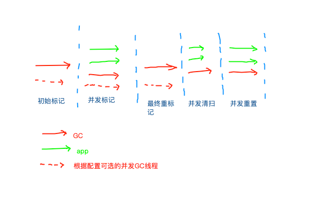
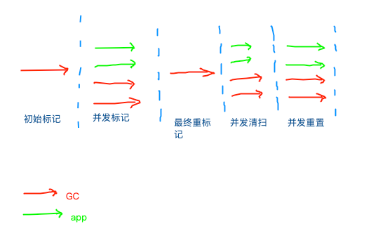
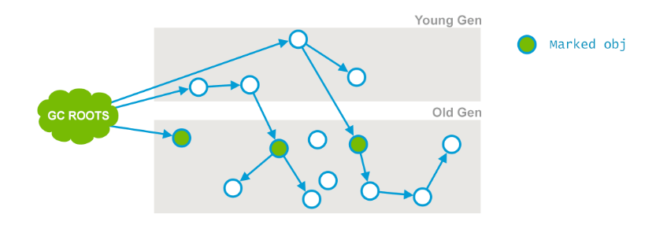
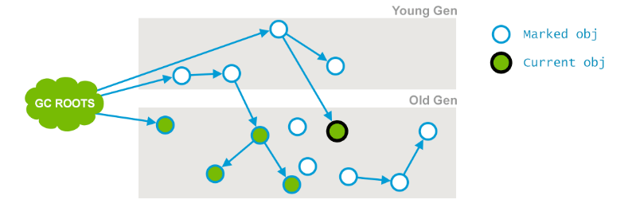
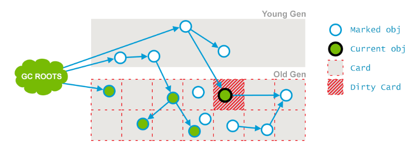
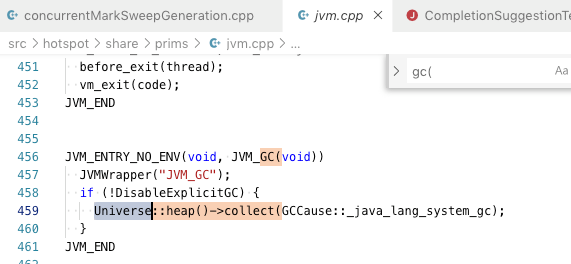
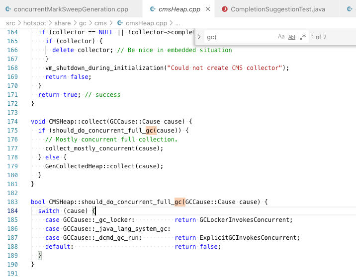
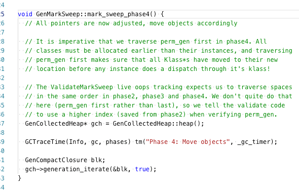

# CMS gc 代码阅读
基于[jdk11](https://github.com/gaoxingliang/openjdk-jdk11u/tree/master/src/hotspot/share/gc/cms)的源码


# 测试代码
```
import java.util.ArrayList;
public class TExample {
    public static void main(String[] args) {
        ArrayList l = new ArrayList<>();
        ArrayList old = new ArrayList();
        for (int i = 0; i < 1000000; i++) {
            if (i % 20000 == 0) {
                l.clear();
            }
            if (i %2 == 0) {
                old.add("WQWQWQWQ" + i);
            }
            if (old.size() > 100000) {
                old.remove(0);
            }
            
            l.add("xsaxsasaxsasaxsasaxsasaxsasaxsasasa" + i);
        }
    }
}

```
在JDK11 上运行:
```
# debug log...
-XX:+UseConcMarkSweepGC -Xlog:gc*=trace -Xmx60m -XX:+UseConcMarkSweepGC

# just info
-XX:+UseConcMarkSweepGC -Xlog:gc* -Xmx60m -XX:+UseConcMarkSweepGC

```

## 示例GC输出
```
[4.958s][info][gc,start     ] GC(7) Pause Initial Mark
[4.958s][info][gc           ] GC(7) Pause Initial Mark 25M->25M(58M) 0.346ms
[4.958s][info][gc,cpu       ] GC(7) User=0.00s Sys=0.00s Real=0.00s
[4.958s][info][gc           ] GC(7) Concurrent Mark
[4.958s][info][gc,task      ] GC(7) Using 2 workers of 3 for marking
[4.963s][info][gc           ] GC(7) Concurrent Mark 4.980ms
[4.963s][info][gc,cpu       ] GC(7) User=0.01s Sys=0.00s Real=0.01s
[4.963s][info][gc           ] GC(7) Concurrent Preclean
[4.964s][info][gc           ] GC(7) Concurrent Preclean 0.537ms
[4.964s][info][gc,cpu       ] GC(7) User=0.00s Sys=0.00s Real=0.00s
[4.964s][info][gc,start     ] GC(7) Pause Remark
[4.965s][info][gc           ] GC(7) Pause Remark 25M->25M(58M) 1.272ms
[4.965s][info][gc,cpu       ] GC(7) User=0.00s Sys=0.00s Real=0.00s
[4.965s][info][gc           ] GC(7) Concurrent Sweep
[4.983s][info][gc           ] GC(7) Concurrent Sweep 17.231ms
[4.983s][info][gc,cpu       ] GC(7) User=0.03s Sys=0.00s Real=0.02s
[4.983s][info][gc           ] GC(7) Concurrent Reset
[4.983s][info][gc           ] GC(7) Concurrent Reset 0.158ms
[4.983s][info][gc,cpu       ] GC(7) User=0.00s Sys=0.00s Real=0.00s
[4.983s][info][gc,heap      ] GC(7) Old: 23943K->7095K(40960K)
```
# CMS 收集的阶段


入口地方[CMSCollector::collect_in_background](https://github.com/gaoxingliang/openjdk-jdk11u/blob/master/src/hotspot/share/gc/cms/concurrentMarkSweepGeneration.cpp#L1709)
```
CMSCollector::collect_in_background
```
基础结构:
```
  while (_collectorState != Idling) {
      switch (state) {
         case inital marking
         case final marking
         case ....
      }
  
  }
```
## Initial Marking
[STW 阶段(业务线程停止)](https://github.com/gaoxingliang/openjdk-jdk11u/blob/master/src/hotspot/share/gc/cms/concurrentMarkSweepGeneration.cpp#L2823), [checkpointRootsInitial](https://github.com/gaoxingliang/openjdk-jdk11u/blob/master/src/hotspot/share/gc/cms/concurrentMarkSweepGeneration.cpp#L5527)
可能是多线程操作(默认多线程, 有配置)[CMSParallelInitialMarkEnabled](https://github.com/gaoxingliang/openjdk-jdk11u/blob/master/src/hotspot/share/gc/cms/concurrentMarkSweepGeneration.cpp#L2871)
扫描GC roots.
将年轻代引用了老年代的对象都作为GCRoots 放入[bitmap](https://github.com/gaoxingliang/openjdk-jdk11u/blob/master/src/hotspot/share/gc/cms/concurrentMarkSweepGeneration.cpp#L2896)


## Marking
进入下一阶段[Marking](https://github.com/gaoxingliang/openjdk-jdk11u/blob/master/src/hotspot/share/gc/cms/concurrentMarkSweepGeneration.cpp#L1818)非STW, [并发标记(多个线程同时标记)](https://github.com/gaoxingliang/openjdk-jdk11u/blob/master/src/hotspot/share/gc/cms/concurrentMarkSweepGeneration.cpp#L2975)
标记堆中所有存活对象.


## Precleaning
进入下一阶段预清理. 不是STW. 这是一个并发阶段, 与应用线程并行运行而不会暂停他们. 
在前一个阶段中, 因为与应用相册那个并行运行,所以某些应用已经改变了. 
那些自己的域已经改变了的对象被JVM标记为脏对象也就是Card Marking. 
在预清理阶段, 这也对象也被认为是存活的.虽然这可能有误报(垃圾也会被标记为活的),
但是重要的是这个避免了实际存活的对象却没有被标记.这个阶段也会做一些最终重标记阶段的准备工作.


根据配置决定下一阶段[CMSPrecleaningEnabled](https://github.com/gaoxingliang/openjdk-jdk11u/blob/master/src/hotspot/share/gc/cms/concurrentMarkSweepGeneration.cpp#L3622)


## Abortable clean
[Abortable clean](https://github.com/gaoxingliang/openjdk-jdk11u/blob/master/src/hotspot/share/gc/cms/concurrentMarkSweepGeneration.cpp#L3634)
这也是一个并发阶段(不会停止应用线程). 该阶段尝试尽可能减轻最终重标记阶段(STW)的工作压力.该阶段的时间与很多因素有关. 因为它不停地迭代做同一件事直到有取消条件满足(比如迭代次数,总的有意义的工作量,经历时间等)

## Remark
这是第二个也是最后一个STW阶段. 该阶段的目的是为了最后标记老年代所有存活的对象.这意味着要从与初始标记一样的GC Roots开始来标记对象, 加上所谓的脏对象(比如那些在前面并发阶段修改过自己域的对象)
[code](https://github.com/gaoxingliang/openjdk-jdk11u/blob/master/src/hotspot/share/gc/cms/concurrentMarkSweepGeneration.cpp#L4129)
根据配置是否多线程重标记.

## Sweep
在并发清理的阶段, 为了解决与应用线程的冲突问题(因为可以同时执行), 所以这个阶段会通过[锁](https://github.com/gaoxingliang/openjdk-jdk11u/blob/master/src/hotspot/share/gc/cms/concurrentMarkSweepGeneration.cpp#L5393)来隔离这些操作.
遍历oldgen,将空闲的chunk放入freelist (根据策略决定是否做freelist的大小合并).

## Reset
恢复CMS相关的内部数据. 


# 什么时候使用serial old gc?
1. 什么条件?
a.JDK11中手动调用System.gc才有可能(在cms中称为foreground gc) 而且带有flag`-XX:-ExplicitGCInvokesConcurrent`



b. JDK8中会在safepoint中可能会调用各个gen的该方法, 然后由具体条件决定是否需要compact.
jdk8中的条件[代码](https://github.com/gaoxingliang/openjdk-jdk/blob/jdk8-b120/hotspot/src/share/vm/gc_implementation/concurrentMarkSweep/concurrentMarkSweepGeneration.cpp#L1952)


2. 怎么实现的?
[在这里调用父类方法GenMarkSweep::invoke_at_safepoint](https://github.com/gaoxingliang/openjdk-jdk11u/blob/master/src/hotspot/share/gc/cms/concurrentMarkSweepGeneration.cpp#L1581)
实际上就是[serial gc](https://github.com/gaoxingliang/openjdk-jdk11u/blob/master/src/hotspot/share/gc/serial/genMarkSweep.cpp#L101)



# 总结
CMS 是一个高吞吐量的分代结构的GC方法, 它包含了一个用于年轻代的copy模式的GC ParNew. 大多数阶段与应用线程并行执行. 但是一般情况下并不会做compact, 有碎片. 而且没有可预估的GC时间.

## TODOS 
1. 在初始化标记阶段 需要检查是否在safepoint. 这个在哪里设置的!?
2. 