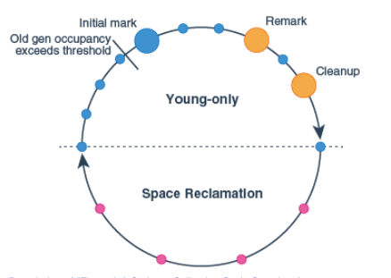

# G1 gc 
通过将GC中的操作分散在小的GC周期中来达到减少STW的目的. 并且实现有目标的GC算法 (max pause time)

# ref
1. [g1gc](https://docs.oracle.com/javase/9/gctuning/garbage-first-garbage-collector.htm#JSGCT-GUID-F1BE86FA-3EDC-4D4F-BDB4-4B044AD83180)