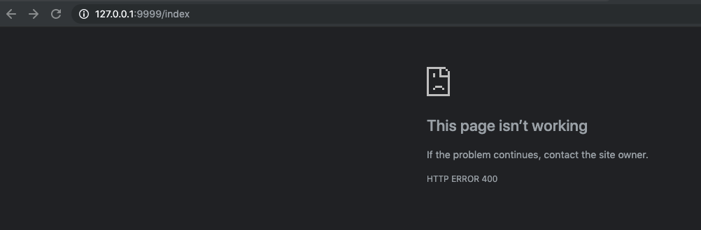
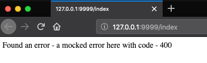

# describe the error page handler issus
https://github.com/eclipse/jetty.project/issues/3806 <br>


# how to reproduce
1. run the class [JettyIssue](../proxydemeo/src/test/java/jettyissue3806/JettyIssue.java)

# Check the behavior on Chrome>=73 and firefox

Chrome 73:
```
my version is Version 77.0.3830.3 (Official Build) canary (64-bit)
```


Firefox:



